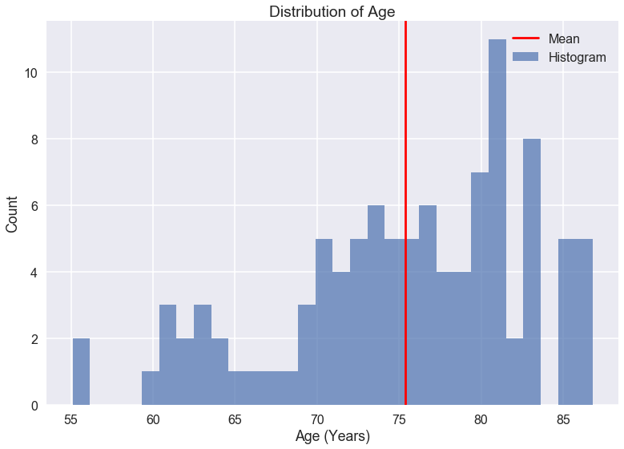

## Contents
{:.no_toc}
*  
{: toc}


## 0. Import libraries


```python
import numpy as np
import pandas as pd
import matplotlib.pyplot as plt
import seaborn as sns
%matplotlib inline
sns.set_context('poster')
```


## 1. Load data


```python
data = pd.read_csv('model.csv')

data['PTMARRY'] = np.where(data['PTMARRY']=='Married','Married','Unmarried')

np.random.seed(9001)
msk = np.random.rand(len(data)) < 0.6
data_train = data[msk]
data_test = data[~msk]
```


### Outcome: reversion back to cognitively normal among MCI patients over 2 years 


```python
print ("Probability of reversion in the training set is %f "%(data_train['MCI_reversion_2y'].mean()))
```


    Probability of reversion in the training set is 0.058824 


## 2. Perform EDA to select potential predictors

### a. Demographics Characteristics 


```python
plt.hist(data_train['AGE'], alpha=0.7, bins=30, label='Histogram')
plt.title('Distribution of Age')
plt.xlabel('Age (Years)')
plt.ylabel('Count')
plt.axvline(data_train.AGE.mean(), 0, 1.0, color='red', label='Mean')
plt.legend();
```





```python
plt.figure(figsize=(25,35))

plt.subplot(3,2,1)
data_age = data_train[['AGE','MCI_reversion_2y']]
sns.boxplot(x='MCI_reversion_2y', y='AGE', data=data_age)
plt.title('Age vs. MCI Reversion')
plt.xlabel('MCI Reversion')
plt.ylabel('Age (Years)')

plt.subplot(3,2,2)
data_gender = data_train[['PTGENDER','MCI_reversion_2y']]
sns.countplot(x='PTGENDER', hue='MCI_reversion_2y', data=data_gender)
plt.title('Gender vs. MCI Reversion')
plt.xlabel('Gender')
plt.ylabel('Count') 
plt.legend(['MCI not reversed to normal','MCI reversed to normal'])
    
plt.subplot(3,2,3)
data_eth = data_train[['PTETHCAT','MCI_reversion_2y']]
sns.countplot(x='PTETHCAT', hue='MCI_reversion_2y', data=data_eth)
plt.title('Ethnicity vs. MCI Reversion')
plt.xlabel('Ethnicity')
plt.ylabel('Count') 
plt.legend(['MCI not reversed to normal','MCI reversed to normal'], loc='upper right')

plt.subplot(3,2,4)
data_race = data_train[['PTRACCAT','MCI_reversion_2y']]
sns.countplot(x='PTRACCAT', hue='MCI_reversion_2y', data=data_race)
plt.title('Race vs. MCI Reversion')
plt.xlabel('Race')
plt.ylabel('Count') 
plt.legend(['MCI not reversed to normal','MCI reversed to normal'], loc='upper right')
    
plt.subplot(3,2,5)
data_edu = data_train[['PTEDUCAT','MCI_reversion_2y']]
sns.boxplot(x='MCI_reversion_2y', y='PTEDUCAT', data=data_edu)
plt.title('Education vs. MCI Reversion')
plt.xlabel('MCI Reversion')
plt.ylabel('Education (Years)')

plt.subplot(3,2,6)
data_mar = data_train[['PTMARRY','MCI_reversion_2y']]
sns.countplot(x='PTMARRY', hue="MCI_reversion_2y", data=data_mar)
plt.title('Marital Status vs. MCI Reversion')
plt.xlabel('Marital Status')
plt.ylabel('Count') 
plt.legend(['MCI not reversed to normal','MCI reversed to normal'], loc='upper right');
```


- #### Interpretation
    - **Age:** Based on the boxplot, young people are more likely to reverse from MCI. Therefore, we select age as our potential predictor.
    - **Gender:** ~60% subjects in the training set is male and ~40% is female. The number of cases in training set is small, but it appears that the probability of MCI reversing to normal is lower among males as compared to females. Therefore, we select gender as our potential predictor.
    - **Ethnicity:** The majority of people in our dataset is 'Non-Hispanic/Latino'. There is no Hispanic/Latino individuals in our training set. We do not have sufficient power to observe the pattern of MCI reversion across different ethnicity groups.
    - **Race:** Again, the majority of people in our training set is 'White'. We do not have sufficient power to observe the pattern of MCI reversion across different race groups.
    - **Education:** There is no apparent relationship between baseline Education and MCI reversion.
    - **Marital Status:** Based on the countplot, married people seem to be more likely to reverse from MCI. We select Martial Status as our potential predictor.

- #### Variable Selection
    - We select **Age**, **Gender**, and **Marital Status** as potential predictors.

### b. Clinical Factors


```python
plt.figure(figsize=(25,20))

plt.subplot(2,2,1)
data_glu = data_train[['PMBLGLUC','MCI_reversion_2y']]
sns.boxplot(x='MCI_reversion_2y', y='PMBLGLUC', data=data_glu)
plt.title('Baseline Blood Glucose Level vs. MCI Reversion')
plt.xlabel('MCI Reversion')
plt.ylabel('Blood Glucose Level (mg/dL)')

plt.subplot(2,2,2)
data_hom = data_train[['HCAMPLAS','MCI_reversion_2y']]
sns.boxplot(x='MCI_reversion_2y', y='HCAMPLAS', data=data_hom)
plt.title('Homocysteine levels vs. MCI Reversion')
plt.xlabel('MCI Reversion')
plt.ylabel('Homocysteine levels (umol/L)')
    
plt.subplot(2,2,3)
data_dia = data_train[['HMSTROKE','MCI_reversion_2y']]
sns.countplot(x="HMSTROKE", hue="MCI_reversion_2y", data=data_dia)
plt.title('History of Stroke vs. MCI Reversion')
plt.xlabel('History of Stroke')
plt.ylabel('Count') 
plt.legend(['MCI not reversed to normal','MCI reversed to normal'], loc='upper right')

plt.subplot(2,2,4)
data_dia = data_train[['HMHYPERT','MCI_reversion_2y']]
sns.countplot(x="HMHYPERT", hue="MCI_reversion_2y", data=data_dia)
plt.title('History of Hypertention vs. MCI Reversion')
plt.xlabel('History of Hypertention')
plt.ylabel('Count') 
plt.legend(['MCI not reversed to normal','MCI reversed to normal'], loc='upper right');
```


- #### Interpretation
    - **Baseline blood glucose level:** There is no clear association between Baseline blood glucose level and MCI reversion.
    - **Homocysteine level:** Based on the boxplot, people with higher Homocysteine level are more likely to reverse from MCI. We select Homocysteine level as our potential predictor.
    - **History of Stroke:** There is only a few cases in the training set. We do not have sufficient power to observe the pattern of MCI reversion across different histories of Stroke.
    - **History of Hypertention:** There is no clear association between History of Hypertention and MCI reversion.

- #### Variable Selection
    - We select **Homocysteine level** as potential predictor.

### c. Lifestyle factors


```python
plt.figure(figsize=(20,8))

plt.subplot(121)
data_smo = data_train[['MH16SMOK','MCI_reversion_2y']]
sns.countplot(x='MH16SMOK', hue="MCI_reversion_2y",data=data_smo)
plt.title('Baseline smoking vs. MCI Reversion')
plt.xlabel('Baseline smoking')
plt.ylabel('Count') 
plt.legend(['MCI not reversed to normal','MCI reversed to normal'])

plt.subplot(122)
data_alc = data_train[['MH14ALCH','MCI_reversion_2y']]
sns.countplot(x='MH14ALCH', hue="MCI_reversion_2y",data=data_alc)
plt.title('Baseline alcohol abuse vs. MCI Reversion')
plt.xlabel('Baseline alcohol abuse')
plt.ylabel('Count') 
plt.legend(['MCI not reversed to normal','MCI reversed to normal'], loc='upper right');
```


- #### Interpretation
    - **Baseline smoking:** Based on the countplot, people who smoke are more likely to reverse from MCI. We select Baseline smoking as potential predictor.
    - **Baseline alcohol abuse:** There is only a few cases in the training set. We do not have sufficient power to observe the pattern of MCI reversion across different alcohol abuse status.

- #### Variable Selection
    - We select **Baseline smoking** as potential predictor. 

### d. Neurocognitive/neuropsychological assessments

#### Histogram


```python
plt.figure(figsize=(30,80))

plt.subplot(7,2,1)
plt.hist(x='MMSE', data=data_train,alpha=0.7,bins=6,label='Histogram');
plt.title('Baseline Mini–Mental State Examination (MMSE)')
plt.xlabel('Baseline MMSE score')
plt.ylabel('Count')
plt.axvline(data_train['MMSE'].mean(), 0, 1.0, color='red', label='Mean')
plt.legend()

plt.subplot(7,2,2)
plt.hist(x='RAVLT_learning', data=data_train,alpha=0.7,bins=10,label='Histogram');
plt.title('Rey Auditory Verbal Learning Test (RAVLT) scores - Learning')
plt.xlabel('RAVLT scores - Learning')
plt.ylabel('Count')
plt.axvline(data_train['RAVLT_learning'].mean(), 0, 1.0, color='red', label='Mean')
plt.legend()
    
plt.subplot(7,2,3)
plt.hist(x='RAVLT_immediate', data=data_train,alpha=0.7,bins=10,label='Histogram');
plt.title('Rey Auditory Verbal Learning Test (RAVLT) scores - Immediate Recall')
plt.xlabel('RAVLT scores - Immediate Recall')
plt.ylabel('Count')
plt.axvline(data_train['RAVLT_immediate'].mean(), 0, 1.0, color='red', label='Mean')
plt.legend()

plt.subplot(7,2,4)
plt.hist(x='RAVLT_forgetting', data=data_train,alpha=0.7,bins=10,label='Histogram');
plt.title('Rey Auditory Verbal Learning Test (RAVLT) scores - Forgetting')
plt.xlabel('RAVLT scores - Forgetting')
plt.ylabel('Count')
plt.axvline(data_train['RAVLT_forgetting'].mean(), 0, 1.0, color='red', label='Mean')
plt.legend()

plt.subplot(7,2,5)
plt.hist(x='RAVLT_perc_forgetting', data=data_train,alpha=0.7,bins=25,label='Histogram');
plt.title('Rey Auditory Verbal Learning Test (RAVLT) scores - Percent Forgetting')
plt.xlabel('RAVLT scores - Percent Forgetting')
plt.ylabel('Count')
plt.axvline(data_train['RAVLT_perc_forgetting'].mean(), 0, 1.0, color='red', label='Mean')
plt.legend()

plt.subplot(7,2,6)
plt.hist(x=data_train['AVLT_Delay_Rec'].dropna(),alpha=0.7,bins=15,label='Histogram');
plt.title('Auditory Verbal Learning Test (AVLT) Delayed Recognition score')
plt.xlabel('AVLT Delayed Recognition score')
plt.ylabel('Count')
plt.axvline(data_train['AVLT_Delay_Rec'].mean(), 0, 1.0, color='red', label='Mean')
plt.legend()
    
plt.subplot(7,2,7)
plt.hist(x=data_train['AVDEL30MIN'].dropna(),alpha=0.7,bins=15,label='Histogram');
plt.title('Auditory Verbal Learning Test (AVLT) Delayed Recall score')
plt.xlabel('AVLT Delayed Recall score')
plt.ylabel('Count')
plt.axvline(data_train['AVDEL30MIN'].mean(), 0, 1.0, color='red', label='Mean')
plt.legend()
    
plt.subplot(7,2,8)
plt.hist(x=data_train['ADAS11'].dropna(),alpha=0.7,bins=20,label='Histogram');
plt.title('Alzheimer’s disease assessment scale-cognitive 11-item progression model (ADAS11)')
plt.xlabel('Baseline ADAS11')
plt.ylabel('Count')
plt.axvline(data_train['ADAS11'].mean(), 0, 1.0, color='red', label='Mean')
plt.legend()
    
plt.subplot(7,2,9)
plt.hist(x=data_train['ADAS13'].dropna(),alpha=0.7,bins=20,label='Histogram');
plt.title('Alzheimer’s disease assessment scale-cognitive 13-item progression model (ADAS13)')
plt.xlabel('Baseline ADAS13')
plt.ylabel('Count')
plt.axvline(data_train['ADAS13'].mean(), 0, 1.0, color='red', label='Mean')
plt.legend()

plt.subplot(7,2,10)
plt.hist(x=data_train['TMT_PtA_Complete'].dropna(),alpha=0.7,bins=25,label='Histogram');
plt.title('Trail making test A')
plt.xlabel('Trail making test A score')
plt.ylabel('Count')
plt.axvline(data_train['TMT_PtA_Complete'].mean(), 0, 1.0, color='red', label='Mean')
plt.legend()

plt.subplot(7,2,11)
plt.hist(x=data_train['TMT_PtB_Complete'].dropna(),alpha=0.7,bins=25,label='Histogram');
plt.title('Trail making test B')
plt.xlabel('Trail making test B score')
plt.ylabel('Count')
plt.axvline(data_train['TMT_PtB_Complete'].mean(), 0, 1.0, color='red', label='Mean')
plt.legend()
    
plt.subplot(7,2,12)
plt.hist(x=data_train['CATANIMSC'].dropna(),alpha=0.7,bins=25,label='Histogram');
plt.title('Animal fluency test score')
plt.xlabel('Animal fluency test score')
plt.ylabel('Count')
plt.axvline(data_train['CATANIMSC'].mean(), 0, 1.0, color='red', label='Mean')
plt.legend()

plt.subplot(7,2,13)
plt.hist(x=data_train['CDRSB'].dropna(),alpha=0.7,bins=8,label='Histogram');
plt.title('Clinical Dementia Rating score')
plt.xlabel('Clinical Dementia Rating score')
plt.ylabel('Count')
plt.axvline(data_train['CDRSB'].mean(), 0, 1.0, color='red', label='Mean')
plt.legend()

plt.subplot(7,2,14)
plt.hist(x=data_train['FAQ'].dropna(),alpha=0.7,bins=20,label='Histogram');
plt.title('Functional Activities Questionnaire (FAQ) score')
plt.xlabel('FAQ score')
plt.ylabel('Count')
plt.axvline(data_train['FAQ'].mean(), 0, 1.0, color='red', label='Mean')
plt.legend();
```


- #### Interpretation
<br/>The majority of the neuropsychological measures appear to have skewed distributions. We may need to normalize or transform these values in the final analyses.

#### Correlation matrix


```python
data_neuro = data_train[['CDRSB','ADAS11','ADAS13','MMSE','RAVLT_immediate','RAVLT_learning','RAVLT_forgetting',
                         'RAVLT_perc_forgetting','AVDEL30MIN','AVLT_Delay_Rec','FAQ','TMT_PtA_Complete','TMT_PtB_Complete',
                         'CATANIMSC']].dropna()

corr = pd.DataFrame(np.corrcoef(data_neuro.T))
corr.columns = ['CDRSB','ADAS11','ADAS13','MMSE','RAVLT_immediate','RAVLT_learning','RAVLT_forgetting',
                         'RAVLT_perc_forgetting','AVDEL30MIN','AVLT_Delay_Rec','FAQ','TMT_PtA_Complete','TMT_PtB_Complete',
                         'CATANIMSC']
```


```python
dpal = sns.choose_colorbrewer_palette(data_type='diverging', as_cmap=True)
```


```python
plt.figure(figsize=(12,10))
plt.pcolor(corr, cmap=dpal, vmin=-1, vmax=1)
labels = ['Clinical Dementia Rating score', 'ADAS11', 'ADAS13', 'MMSE', 'RAVLT Immediate Recall', 'RAVLT Learning', 
          'RAVLT Forgetting', 'RAVLT Percent Forgetting', 'AVLT Delayed Recall score', 'AVLT Delayed Recognition score',
          'FAQ', 'Trail Making Tests A', 'Trail Making Tests B', 'Animal Fluency Test']
plt.xticks(np.arange(data_neuro.shape[1])+0.5, labels, rotation='vertical')
plt.yticks(np.arange(data_neuro.shape[1])+0.5, labels,rotation='horizontal')
plt.title('Heatmap for Neurocognitive/Neuropsychological Assessments Correlations')
plt.colorbar();
```


#### Scatter plot matrix


```python
sns.pairplot(data_neuro[['ADAS11','ADAS13','RAVLT_immediate','RAVLT_learning','RAVLT_forgetting',
                         'RAVLT_perc_forgetting','FAQ','TMT_PtA_Complete','TMT_PtB_Complete','AVLT_Delay_Rec',
                         'AVDEL30MIN']], diag_kind='kde');
```


- #### Interpretation
<br/>Neuropsychological measures in the same domain (e.g. Trail making Tests are in the attention/executive functioning domain; AVLT measures are in the memory domain), tend to be positively correlated. Correlations tend to be weaker and often in opposite directions for inter-domain comparisons.

#### Box plots and count plots


```python
plt.figure(figsize=(30,80))

plt.subplot(7,2,1)
data_mmse = data_train[['MMSE','MCI_reversion_2y']]
sns.countplot(x='MMSE', hue='MCI_reversion_2y', data=data_mmse)
plt.title('Baseline MMSE vs. MCI Reversion')
plt.xlabel('Baseline MMSE score')
plt.ylabel('Count') 
plt.legend(['MCI not reversed to normal','MCI reversed to normal'], loc='upper left')
    
plt.subplot(7,2,2)
data_RAVLT_learning = data_train[['RAVLT_learning','MCI_reversion_2y']]
sns.boxplot(x='MCI_reversion_2y', y='RAVLT_learning', data=data_RAVLT_learning)
plt.title('Rey Auditory Verbal Learning Test (RAVLT) scores - Learning vs. MCI Reversion')
plt.xlabel('MCI Reversion')
plt.ylabel('RAVLT learning')
    
plt.subplot(7,2,3)
data_RAVLT_immediate = data_train[['RAVLT_immediate','MCI_reversion_2y']]
sns.boxplot(x='MCI_reversion_2y', y='RAVLT_immediate', data=data_RAVLT_immediate)
plt.title('Rey Auditory Verbal Learning Test (RAVLT) scores - Immediate Recall vs. MCI Reversion')
plt.xlabel('MCI Reversion')
plt.ylabel('RAVLT immediate')

plt.subplot(7,2,4)
data_RAVLT_forgetting = data_train[['RAVLT_forgetting','MCI_reversion_2y']]
sns.boxplot(x='MCI_reversion_2y', y='RAVLT_forgetting', data=data_RAVLT_forgetting)
plt.title('Rey Auditory Verbal Learning Test (RAVLT) scores - Forgetting vs. MCI Reversion')
plt.xlabel('MCI Reversion')
plt.ylabel('RAVLT forgetting')
    
plt.subplot(7,2,5)
data_RAVLT_perc_forgetting = data_train[['RAVLT_perc_forgetting','MCI_reversion_2y']]
sns.boxplot(x='MCI_reversion_2y', y='RAVLT_perc_forgetting', data=data_RAVLT_perc_forgetting)
plt.title('Rey Auditory Verbal Learning Test (RAVLT) scores - Percent Forgetting vs. MCI Reversion')
plt.xlabel('MCI Reversion')
plt.ylabel('RAVLT perc forgetting')

plt.subplot(7,2,6)
data_AVLT_Delay_Rec = data_train[['AVLT_Delay_Rec','MCI_reversion_2y']]
sns.boxplot(x='MCI_reversion_2y', y='AVLT_Delay_Rec', data=data_AVLT_Delay_Rec)
plt.title('Auditory Verbal Learning Test (AVLT) Delayed Recognition score vs. MCI Reversion')
plt.xlabel('MCI Reversion')
plt.ylabel('AVLT Delay Rec')

plt.subplot(7,2,7)
data_AVDEL30MIN = data_train[['AVDEL30MIN','MCI_reversion_2y']]
sns.boxplot(x='MCI_reversion_2y', y='AVDEL30MIN', data=data_AVDEL30MIN)
plt.title('Auditory Verbal Learning Test (AVLT) Delayed Recall score vs. MCI Reversion')
plt.xlabel('MCI Reversion')
plt.ylabel('AVLT Delayed Recall') 

plt.subplot(7,2,8)
data_ADAS11 = data_train[['ADAS11','MCI_reversion_2y']]
sns.boxplot(x='MCI_reversion_2y', y='ADAS11', data=data_ADAS11)
plt.title('Alzheimer’s disease assessment scale-cognitive 11-item progression model vs. MCI Reversion')
plt.xlabel('MCI Reversion')
plt.ylabel('Baseline [ADAS-cog/11] scale')
    
plt.subplot(7,2,9)
data_ADAS13 = data_train[['ADAS13','MCI_reversion_2y']]
sns.boxplot(x='MCI_reversion_2y', y='ADAS13', data=data_ADAS13)
plt.title('Alzheimer’s disease assessment scale-cognitive 13-item progression model vs. MCI Reversion')
plt.xlabel('MCI Reversion')
plt.ylabel('Baseline [ADAS-cog/13] scale')
    
plt.subplot(7,2,10)
data_TMT_PtA_Complete = data_train[['TMT_PtA_Complete','MCI_reversion_2y']]
sns.boxplot(x='MCI_reversion_2y', y='TMT_PtA_Complete', data=data_TMT_PtA_Complete)
plt.title('Trail making test A vs. MCI Reversion')
plt.xlabel('MCI Reversion')
plt.ylabel('Trail making test A score')
    
plt.subplot(7,2,11)
data_TMT_PtB_Complete = data_train[['TMT_PtB_Complete','MCI_reversion_2y']]
sns.boxplot(x='MCI_reversion_2y', y='TMT_PtB_Complete', data=data_TMT_PtB_Complete)
plt.title('Trail making test B vs. MCI Reversion')
plt.xlabel('MCI Reversion')
plt.ylabel('Trail making test B score')
    
plt.subplot(7,2,12)
data_CATANIMSC = data_train[['CATANIMSC','MCI_reversion_2y']]
sns.boxplot(x='MCI_reversion_2y', y='CATANIMSC', data=data_CATANIMSC)
plt.title('Animal Fluency Score vs. MCI Reversion')
plt.xlabel('MCI Reversion')
plt.ylabel('Animal Fluency Score')

plt.subplot(7,2,13)
data_CDRSB = data_train[['CDRSB','MCI_reversion_2y']]
sns.countplot(x='CDRSB', hue='MCI_reversion_2y', data=data_CDRSB)
plt.title('Clinical Dementia Rating score (CDR-SB) vs. MCI Reversion')
plt.xlabel('CDR-SB')
plt.ylabel('Count') 
plt.legend(['MCI not reversed to normal','MCI reversed to normal'], loc='upper right')

plt.subplot(7,2,14)
data_FAQ = data_train[['FAQ','MCI_reversion_2y']]
sns.boxplot(x='MCI_reversion_2y', y='FAQ', data=data_FAQ)
plt.title('Functional Activities Questionnaire (FAQ) Score vs. MCI Reversion')
plt.xlabel('MCI Reversion')
plt.ylabel('FAQ score');
```


- #### Interpretation
    - **MMSE:** There is no apparent association between baseline MMSE score and MCI reversion. 
    - **Auditory Verbal Learning Test (AVLT) scores:** All the AVLT scores seem to be associated with MCI reversion. RAVLT_forgetting, RAVLT_perc_forgetting, and AVDEL30MIN are strongly correlated. We select RAVLT_immediate, RAVLT_learning, and RAVLT_forgetting as our potential predictors. Lower scores for AVLT suggests poorer memory abilities.
    - **ADAS11 and ADAS13:** These two predictors are strongly correlated and both seem to be associated with MCI reversion (negative correlation). We select ADAS13 as our potential predictor.
    - **Trail making test A and Trail making test B:** These two variables are strongly correlated and both seem to assoicated with MCI reversion. We select Trail making test B as our potential predictor. Higher scores for the trail making tests (TNT A and B), indicate poorer attention/executive function.
    - **Animal Fluency:** Based on the boxplot, people with high Animal Fluency Score are more likely to reverse from MCI. We select Animal Fluency Score as our potential predictor. Lower scores for Animal Fluency represent poorer language skills.
    - **Clinical Dementia Rating score (CDR-SB):** There is no apparent trend between CDR-SB and MCI reversion. Higher CDR-SB scores indicates poorer cogntive/functional performance.
    - **Functional Activities Questionnaire (FAQ) Score:** There is no apparent association between FAQ score and MCI reversion.

- #### Variable Selection
    - We select **RAVLT_immediate**, **RAVLT_learning**, **RAVLT_forgetting**, **ADAS13**, **TMT_PtB_Complete**, and **Animal Fluency Score** as potential predictors.

### e. Neuroimaging Biomarkers


```python
plt.hist(x=data_train['FDG'].dropna(),alpha=0.7,bins=20,label='Histogram');
plt.title('Average FDG-PET of angular, temporal, and posterior cingulate at baseline')
plt.xlabel('Baseline FDG')
plt.ylabel('Count')
plt.axvline(data_train['FDG'].mean(), 0, 1.0, color='red', label='Mean')
plt.legend();
```


```python
data_fdg = data_train[['FDG','MCI_reversion_2y']]
sns.boxplot(x='MCI_reversion_2y', y='FDG', data=data_fdg)
plt.title('Average FDG-PET of angular, temporal, and posterior cingulate at baseline')
plt.xlabel('MCI Reversion')
plt.ylabel('Baseline FDG');
```


- #### Interpretation
<br/>Based on the boxplot, there is no apparent association between baseline fluorodeoxyglucose 18F
uptake on brain positron emission tomography (FDG-PET) and MCI reversion.

- #### Variable Selection
    - We don't select any Neuroimaging Biomarkers.

### f. Cerebrospinal fluid (CSF) Biomarkers

#### Histogram


```python
fig, ax = plt.subplots(1,3,figsize=(20,5))
ax[0].hist(x=data_train['ABETA'].dropna(),alpha=0.7,bins=20,label='Histogram')
ax[1].hist(x=data_train['TAU'].dropna(),alpha=0.7,bins=20,label='Histogram')
ax[2].hist(x=data_train['PTAU'].dropna(),alpha=0.7,bins=20,label='Histogram')
ax[0].set_xlabel("Amyloid Beta (pg/ml)")
ax[1].set_xlabel("Tau (pg/ml)")
ax[2].set_xlabel("Phospho tau (pg/ml)")
ax[0].set_ylabel("Frequency")
ax[1].set_ylabel("Frequency")
ax[2].set_ylabel("Frequency")
ax[0].set_title('Distribution of Baseline Amyloid Beta')
ax[1].set_title('Distribution of Baseline Tau')
ax[2].set_title('Distribution of Basline Phospho Tau');
```


#### Correlation matrix


```python
biomkr = data_train[['ABETA','TAU','PTAU']].dropna()
corr = pd.DataFrame(np.corrcoef(biomkr.T)) # on transposed training matrix
corr.columns = ['ABETA','TAU','PTAU']
dpal = sns.choose_colorbrewer_palette(data_type='diverging', as_cmap=True)
```


```python
fig, ax = plt.subplots(1,1, figsize=(10,8))
plt.pcolor(corr, cmap=dpal, vmin=-1, vmax=1)
plt.xticks(np.arange(biomkr.shape[1])+0.5, {'Phoso Tau','Tau','Amyloid Beta'}, rotation='vertical')
plt.yticks(np.arange(biomkr.shape[1])+0.5, {'Phoso Tau','Tau','Amyloid Beta'}, rotation='horizontal')
plt.title('Heatmap for CSF Biomarkers Correlations')
plt.colorbar();
```


#### Scatter plot matrix


```python
data_biomkr = data_train[['ABETA','TAU','PTAU']].dropna()
sns.pairplot(data_biomkr, diag_kind='kde');
```


- #### Interpretation
<br/>There appears to be a bimodal distribution for amyloid beta, while the tau and phosph-tau levels are right skewed. There is high positive correlation between CSF concentrations tau and phosphoryated-tau, which is unsurprising given that high concentrations of both are indicative of synaptic dysfunction and/or early neurodegeneration. Amyloid-beta concentrations, on the other hand, is negatively correlated with the other two biomarkers, which is consistent with the literature, since low concentrations of amyloid-beta suggest presence of cerebral amyloid accumulation.

#### Box plot


```python
dd = pd.melt(data_train,id_vars=['MCI_reversion_2y'],value_vars=['ABETA','TAU','PTAU'],var_name='biomarkers')
sns.boxplot(x='MCI_reversion_2y',y='value',data=dd,hue='biomarkers')
plt.xlabel('MCI Reversion')
plt.ylabel('Levels (pg/ml)')
plt.title('Cerebrospinal fluid (CSF) Biomarkers vs. MCI Reversion');
```


- #### Interpretation
    - **Beta-amyloid levels at baseline (ABETA):** Based on the boxplot, people with high ABETA are more likely to reverse from MCI. We select ABETA as our potential predictor.
    - **CSF concentrations tau and phosphoryated-tau:** These two predictors are strongly correlated and both seem to be associated with MCI reversion. We selecr TAU as our potential predictor.

- #### Variable Selection
    - We select **ABETA** and **TAU** as potential predictors.

### g. Genetic factors


```python
data_apoe = data_train[['APOE4','MCI_reversion_2y']]
sns.countplot(x='APOE4', hue='MCI_reversion_2y', data=data_apoe)
plt.title('APOE4 Status vs. MCI Reversion')
plt.xlabel('Number of APOE4 Copy')
plt.ylabel('Count') 
plt.legend(['MCI not reversed to normal','MCI reversed to normal']);
```


- #### Interpretation
    - **APOE4 Status:** The APOE4 status seems to be associated with MCI reversion, but the association is not very clear based on this plot. We select APOE status as potential predictor.

- #### Variable Selection
    - We select **APOE4 Status** as potential predictor.

## 3. Summary

Based on the EDA above, we select the following variables as potential predictors for modeling: **Demographic characteristics:** Age, Gender, and Marital Status; **Clinical factors:** Homocysteine level; **Lifestyle factors:**  Baseline smoking; **Neurocognitive/neuropsychological assessments:** RAVLT_immediate, RAVLT_learning, RAVLT_forgetting, ADAS13, TMT_PtB_Complete, and Animal Fluency Score; **Cerebrospinal fluid (CSF) Biomarkers:** ABETA and TAU; **Genetic factors:** APOE4 Status.
