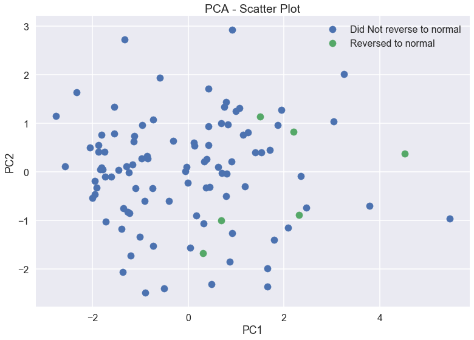
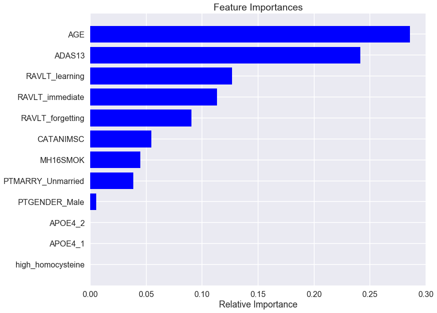
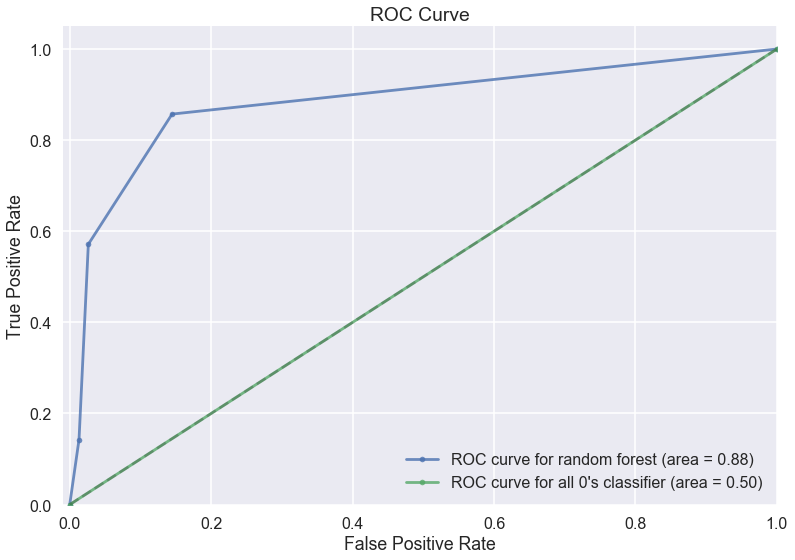

## Contents
{:.no_toc}
*  
{: toc}


## 0. Import libraries


```python
from sklearn.decomposition import PCA
from sklearn.linear_model import LogisticRegressionCV
from sklearn.linear_model import LogisticRegression
from sklearn.model_selection import train_test_split
import sklearn.metrics as metrics
from sklearn.discriminant_analysis import LinearDiscriminantAnalysis
from sklearn.neighbors import KNeighborsClassifier
from sklearn.model_selection import cross_val_score
from sklearn.model_selection import KFold
from sklearn.tree import DecisionTreeClassifier
from sklearn.ensemble import RandomForestClassifier
from sklearn.ensemble import AdaBoostClassifier
```


## 1. Data Processing


```python
data_model = data[['RID','AGE', 'PTGENDER', 'PTMARRY', 'APOE4', 'ADAS13', 'RAVLT_immediate', 'RAVLT_learning', 'TMT_PtB_Complete', 
                   'ABETA', 'TAU', 'RAVLT_forgetting', 'MH16SMOK', 'CATANIMSC', 'high_homocysteine','MCI_reversion_2y',]]
data_model.head()
```


<div>
<style>
    .dataframe thead tr:only-child th {
        text-align: right;
    }

    .dataframe thead th {
        text-align: left;
    }

    .dataframe tbody tr th {
        vertical-align: top;
    }
</style>
<table border="1" class="dataframe">
  <thead>
    <tr style="text-align: right;">
      <th></th>
      <th>RID</th>
      <th>AGE</th>
      <th>PTGENDER</th>
      <th>PTMARRY</th>
      <th>APOE4</th>
      <th>ADAS13</th>
      <th>RAVLT_immediate</th>
      <th>RAVLT_learning</th>
      <th>TMT_PtB_Complete</th>
      <th>ABETA</th>
      <th>TAU</th>
      <th>RAVLT_forgetting</th>
      <th>MH16SMOK</th>
      <th>CATANIMSC</th>
      <th>high_homocysteine</th>
      <th>MCI_reversion_2y</th>
    </tr>
  </thead>
  <tbody>
    <tr>
      <th>0</th>
      <td>6</td>
      <td>80.4</td>
      <td>Female</td>
      <td>Married</td>
      <td>0</td>
      <td>25.67</td>
      <td>30</td>
      <td>1</td>
      <td>168.0</td>
      <td>NaN</td>
      <td>NaN</td>
      <td>5</td>
      <td>0</td>
      <td>13</td>
      <td>0</td>
      <td>0</td>
    </tr>
    <tr>
      <th>1</th>
      <td>33</td>
      <td>83.3</td>
      <td>Male</td>
      <td>Married</td>
      <td>0</td>
      <td>25.67</td>
      <td>21</td>
      <td>4</td>
      <td>NaN</td>
      <td>129.0</td>
      <td>110.0</td>
      <td>6</td>
      <td>1</td>
      <td>16</td>
      <td>0</td>
      <td>0</td>
    </tr>
    <tr>
      <th>2</th>
      <td>51</td>
      <td>66.5</td>
      <td>Male</td>
      <td>Married</td>
      <td>2</td>
      <td>17.67</td>
      <td>29</td>
      <td>1</td>
      <td>94.0</td>
      <td>92.5</td>
      <td>83.1</td>
      <td>4</td>
      <td>0</td>
      <td>9</td>
      <td>0</td>
      <td>0</td>
    </tr>
    <tr>
      <th>3</th>
      <td>80</td>
      <td>85.0</td>
      <td>Male</td>
      <td>Married</td>
      <td>1</td>
      <td>21.00</td>
      <td>23</td>
      <td>4</td>
      <td>81.0</td>
      <td>NaN</td>
      <td>NaN</td>
      <td>3</td>
      <td>0</td>
      <td>17</td>
      <td>0</td>
      <td>0</td>
    </tr>
    <tr>
      <th>4</th>
      <td>98</td>
      <td>84.4</td>
      <td>Female</td>
      <td>Unmarried</td>
      <td>1</td>
      <td>17.67</td>
      <td>25</td>
      <td>4</td>
      <td>167.0</td>
      <td>NaN</td>
      <td>NaN</td>
      <td>5</td>
      <td>1</td>
      <td>17</td>
      <td>0</td>
      <td>0</td>
    </tr>
  </tbody>
</table>
</div>


** Before we start fitting classification models, we notice that there are some values in the three biomarkers columns are missing.**


```python
print('Number of observations with missing predictors is', len(data)-len(data.dropna()))
```


    Number of observations with missing predictors is 141


```python
pd.DataFrame(data_model.isnull().sum(), columns=['Number of missing'])
```


<div>
<style>
    .dataframe thead tr:only-child th {
        text-align: right;
    }

    .dataframe thead th {
        text-align: left;
    }

    .dataframe tbody tr th {
        vertical-align: top;
    }
</style>
<table border="1" class="dataframe">
  <thead>
    <tr style="text-align: right;">
      <th></th>
      <th>Number of missing</th>
    </tr>
  </thead>
  <tbody>
    <tr>
      <th>RID</th>
      <td>0</td>
    </tr>
    <tr>
      <th>AGE</th>
      <td>0</td>
    </tr>
    <tr>
      <th>PTGENDER</th>
      <td>0</td>
    </tr>
    <tr>
      <th>PTMARRY</th>
      <td>0</td>
    </tr>
    <tr>
      <th>APOE4</th>
      <td>0</td>
    </tr>
    <tr>
      <th>ADAS13</th>
      <td>1</td>
    </tr>
    <tr>
      <th>RAVLT_immediate</th>
      <td>0</td>
    </tr>
    <tr>
      <th>RAVLT_learning</th>
      <td>0</td>
    </tr>
    <tr>
      <th>TMT_PtB_Complete</th>
      <td>13</td>
    </tr>
    <tr>
      <th>ABETA</th>
      <td>86</td>
    </tr>
    <tr>
      <th>TAU</th>
      <td>86</td>
    </tr>
    <tr>
      <th>RAVLT_forgetting</th>
      <td>0</td>
    </tr>
    <tr>
      <th>MH16SMOK</th>
      <td>0</td>
    </tr>
    <tr>
      <th>CATANIMSC</th>
      <td>0</td>
    </tr>
    <tr>
      <th>high_homocysteine</th>
      <td>0</td>
    </tr>
    <tr>
      <th>MCI_reversion_2y</th>
      <td>0</td>
    </tr>
  </tbody>
</table>
</div>


```python
data_model = data_model.drop(['TMT_PtB_Complete','ABETA','TAU','RID'],1)
```


**Missing Data Problem**
<br/>We choose to drop predictors instead of dropping observations since we only have 186 observations in our data set. We explained in our report why we did not impute the values.


```python
np.random.seed(9001)
msk = np.random.rand(len(data_model)) < 0.6
data_train = data_model[msk]
data_test = data_model[~msk]

data_train = data_train[np.isfinite(data_train['ADAS13'])]
data_test = data_test[np.isfinite(data_test['ADAS13'])]

X_train = data_train.drop('MCI_reversion_2y',1)
y_train = data_train['MCI_reversion_2y'].values
X_test = data_test.drop('MCI_reversion_2y',1)
y_test = data_test['MCI_reversion_2y'].values
```


```python
attr_cats = ['PTGENDER', 'PTMARRY', 'APOE4']
x_train = pd.get_dummies(X_train, columns=attr_cats, drop_first=True)
x_test = pd.get_dummies(X_test, columns=attr_cats, drop_first=True)

attr_nums = ['AGE', 'RAVLT_immediate', 'RAVLT_learning','RAVLT_forgetting', 'ADAS13', 'CATANIMSC']

means = {attr_num: np.mean(x_train[attr_num]) for attr_num in attr_nums}
sds = {attr_num: np.std(x_train[attr_num], ddof=1) for attr_num in attr_nums}

for attr_num in attr_nums:
    x_train[attr_num] = (x_train[attr_num] - means[attr_num]) / sds[attr_num]
    x_test[attr_num] = (x_test[attr_num] - means[attr_num]) / sds[attr_num]
```


- **Data was split into 60% training set and 40% test set.**
- **All continous variables were standardized:** The majority of classifiers calculate the distance between two points by the Euclidean distance. If one of the features has a broad range of values, the distance will be governed by this particular feature. We notice that the range of values of raw data varies widely, these continuous features should be normalized so that each feature contributes approximately proportionately to the final distance.


```python
print('Number of cases in the training set is', np.sum(y_train))
```


    Number of cases in the training set is 6


**Imbalanced Data Problem**
<br/> There are many more patiants that didn't reverse (Y = 0) than reversed subjects (Y = 1). Therefore, classification accuracy may not be the best metric to evaluate a classifier's performance. As an alternative, we use the confusion matrix to evaluate the classifier.

## 2. PCA Analysis


```python
pca = PCA(n_components=2)
x_train_pca = pca.fit_transform(x_train)

train_pca = pd.DataFrame({'MCI reversion': y_train})
train_pca['pc1'] = x_train_pca[:,0]
train_pca['pc2'] = x_train_pca[:,1]

plt.scatter(train_pca[train_pca['MCI reversion']==0]['pc1'], train_pca[train_pca['MCI reversion']==0]['pc2'], label='Did Not reverse to normal')
plt.scatter(train_pca[train_pca['MCI reversion']==1]['pc1'], train_pca[train_pca['MCI reversion']==1]['pc2'], label='Reversed to normal ')
plt.xlabel('PC1')
plt.ylabel('PC2')
plt.title('PCA - Scatter Plot')
plt.legend();
```





**PCA**
<br/>Each dot here represents a sample. Patients who did not reverse to normal are clustering on the left; patients who reversed to normal are clustering on the right.  

## 3. Classification Models


```python
def tpr(confusion_matrix):
    return confusion_matrix[1][1]/np.sum(confusion_matrix[1])
def fpr(confusion_matrix):
    return confusion_matrix[0][1]/np.sum(confusion_matrix[0])
```


### a. Logistic Regression
We use L2 regularization in logistic regression, with the regularization parameter tuned using 5 fold cross-validation.


```python
logistic = LogisticRegressionCV(cv=5, penalty='l2').fit(x_train, y_train)
logistic_acc_train = logistic.score(x_train, y_train)
logistic_acc_test = logistic.score(x_test, y_test)
cm_log = metrics.confusion_matrix(y_train, logistic.predict(x_train))
auc_log = metrics.roc_auc_score(y_train, logistic.predict_proba(x_train)[:,1])
auc_log_test = metrics.roc_auc_score(y_test, logistic.predict_proba(x_test)[:,1])
```


### b. Linear Discriminant Analysis


```python
lda = LinearDiscriminantAnalysis().fit(x_train, y_train)
lda_acc_train = lda.score(x_train, y_train)
lda_acc_test = lda.score(x_test, y_test)
cm_lda = metrics.confusion_matrix(y_train, lda.predict(x_train))
auc_lda = metrics.roc_auc_score(y_train, lda.predict_proba(x_train)[:,1])
auc_lda_test= metrics.roc_auc_score(y_test, lda.predict_proba(x_test)[:,1])
```


### c. k-NN
We fit k-NN regression models to the training set using different values of k (1 to 20) and choose the best k using 5 fold cross-validation.


```python
neighbors = np.arange(1,20)

cv_scores_knn = []
for k in neighbors:
    knn = KNeighborsClassifier(n_neighbors=k)
    scores = cross_val_score(knn, x_train, y_train, cv=5, scoring='accuracy')
    cv_scores_knn.append(scores.mean())

optimal_k = neighbors[np.argmax(cv_scores_knn)]
print ("The optimal number of neighbors is %d" % optimal_k)
```


    The optimal number of neighbors is 2


```python
knn = KNeighborsClassifier(optimal_k).fit(x_train, y_train)
knn_acc_train = knn.score(x_train, y_train)
knn_acc_test = knn.score(x_test, y_test)
cm_knn = metrics.confusion_matrix(y_train, knn.predict(x_train))
auc_knn= metrics.roc_auc_score(y_train, knn.predict_proba(x_train)[:,1])
auc_knn_test = metrics.roc_auc_score(y_test, knn.predict_proba(x_test)[:,1])
```


### d. Decision Tree
We fit decision tree models to the training set and use 5-fold cross-validation to choose the best (maximum) depth for the tree.


```python
depths = np.arange(2,25)

cv_scores_dt = []
for depth in depths:
    dt = DecisionTreeClassifier(max_depth=depth)
    scores = cross_val_score(dt, x_train, y_train, cv=5, scoring='accuracy')
    cv_scores_dt.append(scores.mean())

best_depth = depths[np.argmax(cv_scores_dt)]
print('The best maximum depth is %d'%(best_depth))
```


    The best maximum depth is 21


```python
dt = DecisionTreeClassifier(max_depth=best_depth)
dt.fit(x_train, y_train)
dt_acc_train = dt.score(x_train, y_train)
dt_acc_test = dt.score(x_test, y_test)
cm_dt = metrics.confusion_matrix(y_train, dt.predict(x_train))
auc_dt = metrics.roc_auc_score(y_train, dt.predict_proba(x_train)[:,1])
auc_dt_test = metrics.roc_auc_score(y_test, dt.predict_proba(x_test)[:,1])
```


### e. Random Forest
We fit random forest models to the training set and use 5-fold cross-validation to choose the optimal value for the number of predictors and trees.


```python
n_features = np.arange(1,8)
n_trees = 2**np.arange(1,9)

cv_scores_rf = {}
for n_feature in n_features:
    for n_tree in n_trees:
        rf = RandomForestClassifier(n_estimators=n_tree, max_features=n_feature, max_depth=best_depth)
        scores = cross_val_score(rf, x_train, y_train, cv=5, scoring='accuracy')
        cv_scores_rf[(n_feature,n_tree)] = scores.mean()
        
best_n_feature, best_n_tree = max(cv_scores_rf, key=cv_scores_rf.get)
print('The optimal value for the number of predictors is %d\nThe optimal value for the number of trees is %d'%(best_n_feature,best_n_tree))
```


    The optimal value for the number of predictors is 4
    The optimal value for the number of trees is 4


```python
rf = RandomForestClassifier(n_estimators=best_n_tree, max_features=best_n_feature, max_depth=best_depth)
rf.fit(x_train, y_train)
rf_acc_train = rf.score(x_train, y_train)
rf_acc_test = rf.score(x_test, y_test)
cm_rf = metrics.confusion_matrix(y_train, rf.predict(x_train))
auc_rf= metrics.roc_auc_score(y_train, rf.predict_proba(x_train)[:,1])
auc_rf_test= metrics.roc_auc_score(y_test, rf.predict_proba(x_test)[:,1])
```


```python
plt.figure(figsize=(12,10))
names = x_train.columns.get_values()
importances = rf.feature_importances_
indices = np.argsort(importances)
plt.title('Feature Importances')
plt.barh(range(len(indices)), importances[indices], color='b', align='center')
plt.yticks(range(len(indices)), names[indices])
plt.xlabel('Relative Importance');
```





### f. Boosting
We fit Boosting models to the training set and apply 5-fold cross-validation to choose the optimal number of trees for the ensemble and the optimal tree depth for the base learners.


```python
n_tree = 2**np.arange(1,5)
depths = [2,5,10,None]

cv_scores_bo = {}
for depth in depths:
    for n in n_tree:
        adaboost = AdaBoostClassifier(DecisionTreeClassifier(max_depth=depth), n_estimators=n, learning_rate=0.05)
        scores = cross_val_score(adaboost, x_train, y_train, cv=5, scoring='accuracy')
        cv_scores_bo[(depth,n)] = scores.mean()
best_depth, best_n_tree = max(cv_scores_bo, key=cv_scores_bo.get)
print('The optimal maximum depth is %d\nThe optimal number of trees is %d'%(best_depth, best_n_tree))
```


    The optimal maximum depth is 2
    The optimal number of trees is 16


```python
adaboost = AdaBoostClassifier(DecisionTreeClassifier(max_depth=best_depth), n_estimators=best_n_tree, learning_rate=0.05)
adaboost.fit(x_train, y_train)
adaboost_acc_train = adaboost.score(x_train, y_train)
adaboost_acc_test = adaboost.score(x_test, y_test)
cm_adaboost = metrics.confusion_matrix(y_train, adaboost.predict(x_train))
auc_adaboost= metrics.roc_auc_score(y_train, adaboost.predict_proba(x_train)[:,1])
auc_adaboost_test= metrics.roc_auc_score(y_test, adaboost.predict_proba(x_test)[:,1])
```

## 4. Model Performance


```python
model = ['Logistic regression','LDA','k-NN','Decision Tree','Random Forest','Adaboost']
column = ['Training accuracy','Test accuracy','True postive rate','False postive rate','AUC_training','AUC_test']

models = pd.DataFrame(index=model, columns=column)
models['Training accuracy']=[logistic_acc_train, lda_acc_train,knn_acc_train,dt_acc_train,rf_acc_train,adaboost_acc_train]
models['Test accuracy']=[logistic_acc_test, lda_acc_test,knn_acc_test,dt_acc_test,rf_acc_test,adaboost_acc_test]
models['True postive rate']=[tpr(cm_log), tpr(cm_lda),tpr(cm_knn),tpr(cm_dt),tpr(cm_rf),tpr(cm_adaboost)]
models['False postive rate']=[fpr(cm_log), fpr(cm_lda),fpr(cm_knn),fpr(cm_dt),fpr(cm_rf),fpr(cm_adaboost)]
models['AUC_training']=[auc_log, auc_lda,auc_knn,auc_dt,auc_rf,auc_adaboost]
models['AUC_test']=[auc_log_test, auc_lda_test,auc_knn_test,auc_dt_test,auc_rf_test,auc_adaboost_test]
models
```


<div>
<style>
    .dataframe thead tr:only-child th {
        text-align: right;
    }

    .dataframe thead th {
        text-align: left;
    }

    .dataframe tbody tr th {
        vertical-align: top;
    }
</style>
<table border="1" class="dataframe">
  <thead>
    <tr style="text-align: right;">
      <th></th>
      <th>Training accuracy</th>
      <th>Test accuracy</th>
      <th>True postive rate</th>
      <th>False postive rate</th>
      <th>AUC_training</th>
      <th>AUC_test</th>
    </tr>
  </thead>
  <tbody>
    <tr>
      <th>Logistic regression</th>
      <td>0.941176</td>
      <td>0.915663</td>
      <td>0.000000</td>
      <td>0.000000</td>
      <td>0.878472</td>
      <td>0.832707</td>
    </tr>
    <tr>
      <th>LDA</th>
      <td>0.950980</td>
      <td>0.891566</td>
      <td>0.333333</td>
      <td>0.010417</td>
      <td>0.947917</td>
      <td>0.642857</td>
    </tr>
    <tr>
      <th>k-NN</th>
      <td>0.941176</td>
      <td>0.903614</td>
      <td>0.000000</td>
      <td>0.000000</td>
      <td>0.973958</td>
      <td>0.588346</td>
    </tr>
    <tr>
      <th>Decision Tree</th>
      <td>1.000000</td>
      <td>0.903614</td>
      <td>1.000000</td>
      <td>0.000000</td>
      <td>1.000000</td>
      <td>0.558271</td>
    </tr>
    <tr>
      <th>Random Forest</th>
      <td>0.980392</td>
      <td>0.915663</td>
      <td>0.666667</td>
      <td>0.000000</td>
      <td>1.000000</td>
      <td>0.884398</td>
    </tr>
    <tr>
      <th>Adaboost</th>
      <td>1.000000</td>
      <td>0.915663</td>
      <td>1.000000</td>
      <td>0.000000</td>
      <td>1.000000</td>
      <td>0.654135</td>
    </tr>
  </tbody>
</table>
</div>


- **Interpretation for model performance**
    - Not surprisingly, the differences of accuracies are too small for us to select the best classifier. The dataset is extremely imbalanced with the majority of non-reverters (Y=0). The classificaton accuracies are not very different from the all 0's classifier that classifies everyone as non-reverter.
    - First, we use the true postive rate to evaluate a classifier's performance. Decision tree, random forest and adaboost are better than other models since they have relatively high TPR; The false postive rates are low for all models; Then, we compare the AUC on the test set for the three selected models. Random forest has the largest AUC_test. Therefore, we select the random forest model as our final model.

### ROC curve for our best model - Random Forest


```python
fpr1, tpr1, thresholds1 = metrics.roc_curve(y_test, rf.predict_proba(x_test)[:,1])
fpr2, tpr2, thresholds2 = metrics.roc_curve(y_test, np.zeros(len(y_test)))
auc1 = metrics.roc_auc_score(y_test, rf.predict_proba(x_test)[:,1])
auc2 = metrics.roc_auc_score(y_test, np.zeros(len(y_test)))
plt.plot(fpr1, tpr1, '.-', alpha=0.8, label='ROC curve for random forest (area = %0.2f)' % (auc1))
plt.plot(fpr2, tpr2, '.-', alpha=0.8, label='ROC curve for all 0\'s classifier (area = %0.2f)' % (auc2))
plt.plot([0, 1], [0, 1], 'k--', alpha=0.2)
plt.xlim([-0.01, 1.0])
plt.ylim([0.0, 1.05])
plt.xlabel('False Positive Rate')
plt.ylabel('True Positive Rate')
plt.title('ROC Curve')
plt.legend(loc="lower right");
```





- **Interpretation for ROC curve**
<br/>The ROC curve shows the tradeoff between sensitivity and specificity (any increase in sensitivity will be accompanied by a decrease in specificity). Our ROC close to the left-hand border and then the top border of the ROC space, which indicates a good performance in terms of sensitivity and specificity for our final random forest model.
