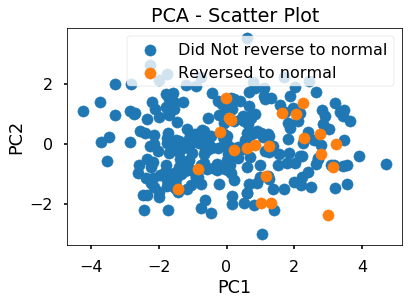
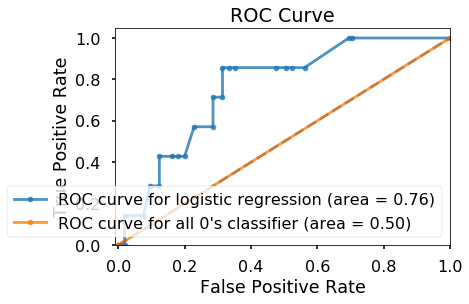

## Contents
{:.no_toc}
*  
{: toc}

## Group 50

## 0. Import libraries


```python
import numpy as np
import pandas as pd
from sklearn.decomposition import PCA
from sklearn.linear_model import LogisticRegressionCV
from sklearn.linear_model import LogisticRegression
from sklearn.model_selection import train_test_split
import sklearn.metrics as metrics
from sklearn.discriminant_analysis import LinearDiscriminantAnalysis
from sklearn.neighbors import KNeighborsClassifier
from sklearn.model_selection import cross_val_score
from sklearn.model_selection import KFold
from sklearn.tree import DecisionTreeClassifier
from sklearn.ensemble import RandomForestClassifier
from sklearn.ensemble import AdaBoostClassifier
import matplotlib.pyplot as plt
import seaborn as sns
%matplotlib inline
sns.set_context('poster')
```


## 1. Data Processing

### Load data


```python
data = pd.read_csv("data_model.csv", index_col=0)
data.head()
```


<div>
<style>
    .dataframe thead tr:only-child th {
        text-align: right;
    }

    .dataframe thead th {
        text-align: left;
    }

    .dataframe tbody tr th {
        vertical-align: top;
    }
</style>
<table border="1" class="dataframe">
  <thead>
    <tr style="text-align: right;">
      <th></th>
      <th>RID</th>
      <th>AGE</th>
      <th>PTGENDER</th>
      <th>PTEDUCAT</th>
      <th>PTMARRY</th>
      <th>HCAMPLAS</th>
      <th>BMI</th>
      <th>MH16SMOK</th>
      <th>RAVLT_immediate</th>
      <th>RAVLT_learning</th>
      <th>...</th>
      <th>AVLT_Delay_Rec</th>
      <th>ADAS13</th>
      <th>TMT_PtB_Complete</th>
      <th>CATANIMSC</th>
      <th>FAQ</th>
      <th>FDG</th>
      <th>ABETA</th>
      <th>TAU</th>
      <th>APOE4</th>
      <th>MCI_reversion_2y</th>
    </tr>
    <tr>
      <th>Phase</th>
      <th></th>
      <th></th>
      <th></th>
      <th></th>
      <th></th>
      <th></th>
      <th></th>
      <th></th>
      <th></th>
      <th></th>
      <th></th>
      <th></th>
      <th></th>
      <th></th>
      <th></th>
      <th></th>
      <th></th>
      <th></th>
      <th></th>
      <th></th>
      <th></th>
    </tr>
  </thead>
  <tbody>
    <tr>
      <th>ADNI1</th>
      <td>6</td>
      <td>80.4</td>
      <td>Female</td>
      <td>13</td>
      <td>Married</td>
      <td>9.7</td>
      <td>24.324697</td>
      <td>0</td>
      <td>30</td>
      <td>1</td>
      <td>...</td>
      <td>7.0</td>
      <td>25.67</td>
      <td>168.0</td>
      <td>13</td>
      <td>0.0</td>
      <td>NaN</td>
      <td>NaN</td>
      <td>NaN</td>
      <td>0</td>
      <td>0</td>
    </tr>
    <tr>
      <th>ADNI1</th>
      <td>33</td>
      <td>83.3</td>
      <td>Male</td>
      <td>20</td>
      <td>Married</td>
      <td>7.1</td>
      <td>12.511363</td>
      <td>1</td>
      <td>21</td>
      <td>4</td>
      <td>...</td>
      <td>NaN</td>
      <td>25.67</td>
      <td>NaN</td>
      <td>16</td>
      <td>6.0</td>
      <td>1.10567</td>
      <td>129.0</td>
      <td>110.0</td>
      <td>0</td>
      <td>0</td>
    </tr>
    <tr>
      <th>ADNI1</th>
      <td>51</td>
      <td>66.5</td>
      <td>Male</td>
      <td>18</td>
      <td>Married</td>
      <td>8.8</td>
      <td>23.849469</td>
      <td>0</td>
      <td>29</td>
      <td>1</td>
      <td>...</td>
      <td>10.0</td>
      <td>17.67</td>
      <td>94.0</td>
      <td>9</td>
      <td>2.0</td>
      <td>1.36977</td>
      <td>92.5</td>
      <td>83.1</td>
      <td>2</td>
      <td>0</td>
    </tr>
    <tr>
      <th>ADNI1</th>
      <td>80</td>
      <td>85.0</td>
      <td>Male</td>
      <td>18</td>
      <td>Married</td>
      <td>10.8</td>
      <td>23.242022</td>
      <td>0</td>
      <td>23</td>
      <td>4</td>
      <td>...</td>
      <td>11.0</td>
      <td>21.00</td>
      <td>81.0</td>
      <td>17</td>
      <td>1.0</td>
      <td>1.21013</td>
      <td>NaN</td>
      <td>NaN</td>
      <td>1</td>
      <td>0</td>
    </tr>
    <tr>
      <th>ADNI1</th>
      <td>98</td>
      <td>84.4</td>
      <td>Female</td>
      <td>16</td>
      <td>Unmarried</td>
      <td>12.2</td>
      <td>24.248285</td>
      <td>1</td>
      <td>25</td>
      <td>4</td>
      <td>...</td>
      <td>15.0</td>
      <td>17.67</td>
      <td>167.0</td>
      <td>17</td>
      <td>4.0</td>
      <td>NaN</td>
      <td>NaN</td>
      <td>NaN</td>
      <td>1</td>
      <td>0</td>
    </tr>
  </tbody>
</table>
<p>5 rows × 21 columns</p>
</div>


```python
data.columns.get_values()
```


    array(['RID', 'AGE', 'PTGENDER', 'PTEDUCAT', 'PTMARRY', 'HCAMPLAS', 'BMI',
           'MH16SMOK', 'RAVLT_immediate', 'RAVLT_learning',
           'RAVLT_perc_forgetting', 'AVLT_Delay_Rec', 'ADAS13',
           'TMT_PtB_Complete', 'CATANIMSC', 'FAQ', 'FDG', 'ABETA', 'TAU',
           'APOE4', 'MCI_reversion_2y'], dtype=object)


** Before we start fitting classification models, we notice that there are some values in the three biomarkers columns are missing.**


```python
print('Number of observations with missing predictors is', len(data)-len(data.dropna()))
```


    Number of observations with missing predictors is 355


```python
data.isnull().sum()
```


    RID                        0
    AGE                        0
    PTGENDER                   0
    PTEDUCAT                   0
    PTMARRY                    0
    HCAMPLAS                 214
    BMI                        0
    MH16SMOK                   0
    RAVLT_immediate            0
    RAVLT_learning             0
    RAVLT_perc_forgetting      0
    AVLT_Delay_Rec           227
    ADAS13                     2
    TMT_PtB_Complete         227
    CATANIMSC                  0
    FAQ                        4
    FDG                       79
    ABETA                    104
    TAU                      108
    APOE4                      0
    MCI_reversion_2y           0
    dtype: int64


```python
data = data.drop(['HCAMPLAS','AVLT_Delay_Rec','ABETA','TMT_PtB_Complete','FDG','TAU','RID'],1)
data = data[np.isfinite(data['ADAS13'])]
data = data[np.isfinite(data['FAQ'])]
data
```


<div>
<style>
    .dataframe thead tr:only-child th {
        text-align: right;
    }

    .dataframe thead th {
        text-align: left;
    }

    .dataframe tbody tr th {
        vertical-align: top;
    }
</style>
<table border="1" class="dataframe">
  <thead>
    <tr style="text-align: right;">
      <th></th>
      <th>AGE</th>
      <th>PTGENDER</th>
      <th>PTEDUCAT</th>
      <th>PTMARRY</th>
      <th>BMI</th>
      <th>MH16SMOK</th>
      <th>RAVLT_immediate</th>
      <th>RAVLT_learning</th>
      <th>RAVLT_perc_forgetting</th>
      <th>ADAS13</th>
      <th>CATANIMSC</th>
      <th>FAQ</th>
      <th>APOE4</th>
      <th>MCI_reversion_2y</th>
    </tr>
    <tr>
      <th>Phase</th>
      <th></th>
      <th></th>
      <th></th>
      <th></th>
      <th></th>
      <th></th>
      <th></th>
      <th></th>
      <th></th>
      <th></th>
      <th></th>
      <th></th>
      <th></th>
      <th></th>
    </tr>
  </thead>
  <tbody>
    <tr>
      <th>ADNI1</th>
      <td>80.4</td>
      <td>Female</td>
      <td>13</td>
      <td>Married</td>
      <td>24.324697</td>
      <td>0</td>
      <td>30</td>
      <td>1</td>
      <td>83.33330</td>
      <td>25.67</td>
      <td>13</td>
      <td>0.0</td>
      <td>0</td>
      <td>0</td>
    </tr>
    <tr>
      <th>ADNI1</th>
      <td>83.3</td>
      <td>Male</td>
      <td>20</td>
      <td>Married</td>
      <td>12.511363</td>
      <td>1</td>
      <td>21</td>
      <td>4</td>
      <td>100.00000</td>
      <td>25.67</td>
      <td>16</td>
      <td>6.0</td>
      <td>0</td>
      <td>0</td>
    </tr>
    <tr>
      <th>ADNI1</th>
      <td>66.5</td>
      <td>Male</td>
      <td>18</td>
      <td>Married</td>
      <td>23.849469</td>
      <td>0</td>
      <td>29</td>
      <td>1</td>
      <td>57.14290</td>
      <td>17.67</td>
      <td>9</td>
      <td>2.0</td>
      <td>2</td>
      <td>0</td>
    </tr>
    <tr>
      <th>ADNI1</th>
      <td>85.0</td>
      <td>Male</td>
      <td>18</td>
      <td>Married</td>
      <td>23.242022</td>
      <td>0</td>
      <td>23</td>
      <td>4</td>
      <td>42.85710</td>
      <td>21.00</td>
      <td>17</td>
      <td>1.0</td>
      <td>1</td>
      <td>0</td>
    </tr>
    <tr>
      <th>ADNI1</th>
      <td>84.4</td>
      <td>Female</td>
      <td>16</td>
      <td>Unmarried</td>
      <td>24.248285</td>
      <td>1</td>
      <td>25</td>
      <td>4</td>
      <td>55.55560</td>
      <td>17.67</td>
      <td>17</td>
      <td>4.0</td>
      <td>1</td>
      <td>0</td>
    </tr>
    <tr>
      <th>ADNI1</th>
      <td>60.7</td>
      <td>Female</td>
      <td>19</td>
      <td>Married</td>
      <td>26.124818</td>
      <td>0</td>
      <td>50</td>
      <td>10</td>
      <td>21.42860</td>
      <td>3.00</td>
      <td>17</td>
      <td>0.0</td>
      <td>0</td>
      <td>0</td>
    </tr>
    <tr>
      <th>ADNI1</th>
      <td>70.6</td>
      <td>Male</td>
      <td>18</td>
      <td>Married</td>
      <td>21.462681</td>
      <td>0</td>
      <td>50</td>
      <td>9</td>
      <td>7.14286</td>
      <td>9.00</td>
      <td>19</td>
      <td>0.0</td>
      <td>1</td>
      <td>1</td>
    </tr>
    <tr>
      <th>ADNI1</th>
      <td>78.4</td>
      <td>Male</td>
      <td>18</td>
      <td>Married</td>
      <td>24.385069</td>
      <td>1</td>
      <td>30</td>
      <td>4</td>
      <td>100.00000</td>
      <td>15.33</td>
      <td>16</td>
      <td>1.0</td>
      <td>0</td>
      <td>0</td>
    </tr>
    <tr>
      <th>ADNI1</th>
      <td>77.5</td>
      <td>Female</td>
      <td>14</td>
      <td>Unmarried</td>
      <td>27.498478</td>
      <td>0</td>
      <td>35</td>
      <td>3</td>
      <td>87.50000</td>
      <td>14.67</td>
      <td>24</td>
      <td>0.0</td>
      <td>1</td>
      <td>0</td>
    </tr>
    <tr>
      <th>ADNI1</th>
      <td>86.3</td>
      <td>Male</td>
      <td>15</td>
      <td>Married</td>
      <td>28.008268</td>
      <td>0</td>
      <td>45</td>
      <td>9</td>
      <td>15.38460</td>
      <td>8.00</td>
      <td>25</td>
      <td>0.0</td>
      <td>0</td>
      <td>1</td>
    </tr>
    <tr>
      <th>ADNI1</th>
      <td>79.2</td>
      <td>Male</td>
      <td>14</td>
      <td>Unmarried</td>
      <td>29.264149</td>
      <td>0</td>
      <td>39</td>
      <td>7</td>
      <td>30.00000</td>
      <td>17.33</td>
      <td>14</td>
      <td>0.0</td>
      <td>1</td>
      <td>0</td>
    </tr>
    <tr>
      <th>ADNI1</th>
      <td>73.9</td>
      <td>Male</td>
      <td>12</td>
      <td>Married</td>
      <td>25.941527</td>
      <td>0</td>
      <td>31</td>
      <td>2</td>
      <td>100.00000</td>
      <td>22.33</td>
      <td>16</td>
      <td>4.0</td>
      <td>0</td>
      <td>0</td>
    </tr>
    <tr>
      <th>ADNI1</th>
      <td>81.1</td>
      <td>Male</td>
      <td>16</td>
      <td>Married</td>
      <td>20.661684</td>
      <td>0</td>
      <td>26</td>
      <td>0</td>
      <td>100.00000</td>
      <td>19.33</td>
      <td>20</td>
      <td>2.0</td>
      <td>1</td>
      <td>0</td>
    </tr>
    <tr>
      <th>ADNI1</th>
      <td>80.4</td>
      <td>Female</td>
      <td>13</td>
      <td>Married</td>
      <td>24.191777</td>
      <td>0</td>
      <td>37</td>
      <td>4</td>
      <td>50.00000</td>
      <td>11.33</td>
      <td>13</td>
      <td>1.0</td>
      <td>0</td>
      <td>0</td>
    </tr>
    <tr>
      <th>ADNI1</th>
      <td>75.2</td>
      <td>Male</td>
      <td>16</td>
      <td>Married</td>
      <td>3.586969</td>
      <td>1</td>
      <td>28</td>
      <td>3</td>
      <td>100.00000</td>
      <td>24.00</td>
      <td>10</td>
      <td>0.0</td>
      <td>1</td>
      <td>0</td>
    </tr>
    <tr>
      <th>ADNI1</th>
      <td>71.9</td>
      <td>Female</td>
      <td>16</td>
      <td>Married</td>
      <td>21.140357</td>
      <td>0</td>
      <td>51</td>
      <td>4</td>
      <td>41.66670</td>
      <td>19.67</td>
      <td>17</td>
      <td>0.0</td>
      <td>1</td>
      <td>0</td>
    </tr>
    <tr>
      <th>ADNI1</th>
      <td>74.7</td>
      <td>Male</td>
      <td>19</td>
      <td>Married</td>
      <td>23.077706</td>
      <td>0</td>
      <td>17</td>
      <td>0</td>
      <td>100.00000</td>
      <td>20.33</td>
      <td>24</td>
      <td>5.0</td>
      <td>1</td>
      <td>0</td>
    </tr>
    <tr>
      <th>ADNI1</th>
      <td>64.8</td>
      <td>Male</td>
      <td>20</td>
      <td>Married</td>
      <td>27.073389</td>
      <td>0</td>
      <td>40</td>
      <td>6</td>
      <td>54.54550</td>
      <td>9.33</td>
      <td>16</td>
      <td>2.0</td>
      <td>0</td>
      <td>0</td>
    </tr>
    <tr>
      <th>ADNI1</th>
      <td>86.1</td>
      <td>Male</td>
      <td>16</td>
      <td>Married</td>
      <td>22.598716</td>
      <td>0</td>
      <td>47</td>
      <td>4</td>
      <td>63.63640</td>
      <td>8.00</td>
      <td>16</td>
      <td>9.0</td>
      <td>1</td>
      <td>1</td>
    </tr>
    <tr>
      <th>ADNI1</th>
      <td>61.4</td>
      <td>Male</td>
      <td>16</td>
      <td>Married</td>
      <td>4.131574</td>
      <td>0</td>
      <td>39</td>
      <td>3</td>
      <td>11.11110</td>
      <td>15.67</td>
      <td>15</td>
      <td>1.0</td>
      <td>0</td>
      <td>0</td>
    </tr>
    <tr>
      <th>ADNI1</th>
      <td>66.5</td>
      <td>Female</td>
      <td>18</td>
      <td>Married</td>
      <td>3.377240</td>
      <td>0</td>
      <td>60</td>
      <td>6</td>
      <td>14.28570</td>
      <td>3.33</td>
      <td>28</td>
      <td>0.0</td>
      <td>0</td>
      <td>1</td>
    </tr>
    <tr>
      <th>ADNI1</th>
      <td>82.4</td>
      <td>Female</td>
      <td>17</td>
      <td>Unmarried</td>
      <td>26.777125</td>
      <td>0</td>
      <td>41</td>
      <td>5</td>
      <td>27.27270</td>
      <td>12.67</td>
      <td>16</td>
      <td>0.0</td>
      <td>0</td>
      <td>0</td>
    </tr>
    <tr>
      <th>ADNI1</th>
      <td>79.6</td>
      <td>Female</td>
      <td>12</td>
      <td>Married</td>
      <td>22.919216</td>
      <td>0</td>
      <td>46</td>
      <td>3</td>
      <td>72.72730</td>
      <td>21.33</td>
      <td>22</td>
      <td>0.0</td>
      <td>2</td>
      <td>0</td>
    </tr>
    <tr>
      <th>ADNI1</th>
      <td>62.8</td>
      <td>Male</td>
      <td>12</td>
      <td>Married</td>
      <td>35.083079</td>
      <td>0</td>
      <td>27</td>
      <td>3</td>
      <td>100.00000</td>
      <td>23.00</td>
      <td>20</td>
      <td>0.0</td>
      <td>0</td>
      <td>0</td>
    </tr>
    <tr>
      <th>ADNI1</th>
      <td>70.9</td>
      <td>Male</td>
      <td>18</td>
      <td>Married</td>
      <td>26.011262</td>
      <td>0</td>
      <td>52</td>
      <td>9</td>
      <td>0.00000</td>
      <td>9.67</td>
      <td>26</td>
      <td>8.0</td>
      <td>0</td>
      <td>0</td>
    </tr>
    <tr>
      <th>ADNI1</th>
      <td>65.6</td>
      <td>Male</td>
      <td>10</td>
      <td>Married</td>
      <td>25.547430</td>
      <td>1</td>
      <td>49</td>
      <td>7</td>
      <td>50.00000</td>
      <td>11.00</td>
      <td>17</td>
      <td>4.0</td>
      <td>1</td>
      <td>0</td>
    </tr>
    <tr>
      <th>ADNI1</th>
      <td>75.2</td>
      <td>Male</td>
      <td>16</td>
      <td>Married</td>
      <td>27.124403</td>
      <td>1</td>
      <td>31</td>
      <td>6</td>
      <td>60.00000</td>
      <td>11.33</td>
      <td>16</td>
      <td>3.0</td>
      <td>1</td>
      <td>0</td>
    </tr>
    <tr>
      <th>ADNI1</th>
      <td>79.4</td>
      <td>Male</td>
      <td>16</td>
      <td>Unmarried</td>
      <td>21.373364</td>
      <td>1</td>
      <td>31</td>
      <td>5</td>
      <td>33.33330</td>
      <td>10.33</td>
      <td>13</td>
      <td>2.0</td>
      <td>1</td>
      <td>0</td>
    </tr>
    <tr>
      <th>ADNI1</th>
      <td>76.4</td>
      <td>Male</td>
      <td>16</td>
      <td>Married</td>
      <td>11.558622</td>
      <td>1</td>
      <td>20</td>
      <td>2</td>
      <td>100.00000</td>
      <td>29.67</td>
      <td>8</td>
      <td>4.0</td>
      <td>0</td>
      <td>0</td>
    </tr>
    <tr>
      <th>ADNI1</th>
      <td>79.1</td>
      <td>Male</td>
      <td>10</td>
      <td>Married</td>
      <td>36.736519</td>
      <td>0</td>
      <td>23</td>
      <td>7</td>
      <td>25.00000</td>
      <td>24.00</td>
      <td>10</td>
      <td>0.0</td>
      <td>0</td>
      <td>0</td>
    </tr>
    <tr>
      <th>...</th>
      <td>...</td>
      <td>...</td>
      <td>...</td>
      <td>...</td>
      <td>...</td>
      <td>...</td>
      <td>...</td>
      <td>...</td>
      <td>...</td>
      <td>...</td>
      <td>...</td>
      <td>...</td>
      <td>...</td>
      <td>...</td>
    </tr>
    <tr>
      <th>ADNI2</th>
      <td>57.7</td>
      <td>Female</td>
      <td>18</td>
      <td>Married</td>
      <td>3.126292</td>
      <td>0</td>
      <td>59</td>
      <td>6</td>
      <td>-15.38460</td>
      <td>3.00</td>
      <td>18</td>
      <td>1.0</td>
      <td>1</td>
      <td>0</td>
    </tr>
    <tr>
      <th>ADNI2</th>
      <td>74.2</td>
      <td>Male</td>
      <td>20</td>
      <td>Married</td>
      <td>4.499530</td>
      <td>0</td>
      <td>42</td>
      <td>7</td>
      <td>63.63640</td>
      <td>8.00</td>
      <td>21</td>
      <td>0.0</td>
      <td>1</td>
      <td>0</td>
    </tr>
    <tr>
      <th>ADNI2</th>
      <td>84.4</td>
      <td>Male</td>
      <td>16</td>
      <td>Married</td>
      <td>3.318075</td>
      <td>0</td>
      <td>43</td>
      <td>8</td>
      <td>38.46150</td>
      <td>13.00</td>
      <td>16</td>
      <td>0.0</td>
      <td>1</td>
      <td>0</td>
    </tr>
    <tr>
      <th>ADNI2</th>
      <td>76.1</td>
      <td>Female</td>
      <td>18</td>
      <td>Unmarried</td>
      <td>31.584120</td>
      <td>0</td>
      <td>38</td>
      <td>9</td>
      <td>41.66670</td>
      <td>7.00</td>
      <td>22</td>
      <td>3.0</td>
      <td>0</td>
      <td>0</td>
    </tr>
    <tr>
      <th>ADNI2</th>
      <td>75.0</td>
      <td>Male</td>
      <td>20</td>
      <td>Married</td>
      <td>25.544108</td>
      <td>0</td>
      <td>35</td>
      <td>4</td>
      <td>77.77780</td>
      <td>23.00</td>
      <td>18</td>
      <td>1.0</td>
      <td>1</td>
      <td>0</td>
    </tr>
    <tr>
      <th>ADNI2</th>
      <td>75.6</td>
      <td>Male</td>
      <td>18</td>
      <td>Unmarried</td>
      <td>26.728814</td>
      <td>1</td>
      <td>29</td>
      <td>6</td>
      <td>100.00000</td>
      <td>15.00</td>
      <td>14</td>
      <td>2.0</td>
      <td>0</td>
      <td>0</td>
    </tr>
    <tr>
      <th>ADNI2</th>
      <td>59.7</td>
      <td>Male</td>
      <td>15</td>
      <td>Married</td>
      <td>4.567681</td>
      <td>1</td>
      <td>34</td>
      <td>3</td>
      <td>57.14290</td>
      <td>10.00</td>
      <td>20</td>
      <td>0.0</td>
      <td>2</td>
      <td>0</td>
    </tr>
    <tr>
      <th>ADNI2</th>
      <td>68.1</td>
      <td>Female</td>
      <td>12</td>
      <td>Married</td>
      <td>27.884561</td>
      <td>0</td>
      <td>36</td>
      <td>3</td>
      <td>50.00000</td>
      <td>11.00</td>
      <td>14</td>
      <td>2.0</td>
      <td>1</td>
      <td>0</td>
    </tr>
    <tr>
      <th>ADNI2</th>
      <td>68.1</td>
      <td>Male</td>
      <td>12</td>
      <td>Unmarried</td>
      <td>5.251334</td>
      <td>0</td>
      <td>35</td>
      <td>4</td>
      <td>77.77780</td>
      <td>19.00</td>
      <td>16</td>
      <td>0.0</td>
      <td>1</td>
      <td>0</td>
    </tr>
    <tr>
      <th>ADNI2</th>
      <td>75.2</td>
      <td>Male</td>
      <td>20</td>
      <td>Married</td>
      <td>20.734276</td>
      <td>0</td>
      <td>40</td>
      <td>2</td>
      <td>22.22220</td>
      <td>11.00</td>
      <td>28</td>
      <td>1.0</td>
      <td>1</td>
      <td>0</td>
    </tr>
    <tr>
      <th>ADNI2</th>
      <td>74.8</td>
      <td>Female</td>
      <td>19</td>
      <td>Married</td>
      <td>33.971599</td>
      <td>1</td>
      <td>37</td>
      <td>6</td>
      <td>70.00000</td>
      <td>17.00</td>
      <td>18</td>
      <td>0.0</td>
      <td>0</td>
      <td>0</td>
    </tr>
    <tr>
      <th>ADNI2</th>
      <td>76.2</td>
      <td>Male</td>
      <td>20</td>
      <td>Married</td>
      <td>26.688008</td>
      <td>1</td>
      <td>25</td>
      <td>1</td>
      <td>100.00000</td>
      <td>14.00</td>
      <td>13</td>
      <td>0.0</td>
      <td>2</td>
      <td>0</td>
    </tr>
    <tr>
      <th>ADNI2</th>
      <td>75.0</td>
      <td>Male</td>
      <td>12</td>
      <td>Married</td>
      <td>38.369966</td>
      <td>0</td>
      <td>21</td>
      <td>1</td>
      <td>100.00000</td>
      <td>26.00</td>
      <td>12</td>
      <td>8.0</td>
      <td>0</td>
      <td>0</td>
    </tr>
    <tr>
      <th>ADNI2</th>
      <td>62.5</td>
      <td>Male</td>
      <td>18</td>
      <td>Married</td>
      <td>25.620133</td>
      <td>0</td>
      <td>18</td>
      <td>0</td>
      <td>100.00000</td>
      <td>14.00</td>
      <td>6</td>
      <td>0.0</td>
      <td>1</td>
      <td>0</td>
    </tr>
    <tr>
      <th>ADNI2</th>
      <td>60.2</td>
      <td>Male</td>
      <td>14</td>
      <td>Unmarried</td>
      <td>29.557686</td>
      <td>0</td>
      <td>57</td>
      <td>10</td>
      <td>20.00000</td>
      <td>5.00</td>
      <td>23</td>
      <td>0.0</td>
      <td>1</td>
      <td>0</td>
    </tr>
    <tr>
      <th>ADNI2</th>
      <td>68.0</td>
      <td>Male</td>
      <td>14</td>
      <td>Married</td>
      <td>26.853413</td>
      <td>1</td>
      <td>35</td>
      <td>3</td>
      <td>75.00000</td>
      <td>22.00</td>
      <td>18</td>
      <td>2.0</td>
      <td>1</td>
      <td>0</td>
    </tr>
    <tr>
      <th>ADNI2</th>
      <td>59.6</td>
      <td>Male</td>
      <td>20</td>
      <td>Married</td>
      <td>2.476435</td>
      <td>1</td>
      <td>41</td>
      <td>2</td>
      <td>66.66670</td>
      <td>16.00</td>
      <td>25</td>
      <td>0.0</td>
      <td>1</td>
      <td>1</td>
    </tr>
    <tr>
      <th>ADNI2</th>
      <td>61.7</td>
      <td>Male</td>
      <td>16</td>
      <td>Married</td>
      <td>39.716347</td>
      <td>0</td>
      <td>65</td>
      <td>7</td>
      <td>6.66667</td>
      <td>5.00</td>
      <td>22</td>
      <td>1.0</td>
      <td>0</td>
      <td>0</td>
    </tr>
    <tr>
      <th>ADNI2</th>
      <td>73.4</td>
      <td>Male</td>
      <td>19</td>
      <td>Married</td>
      <td>4.133281</td>
      <td>1</td>
      <td>44</td>
      <td>8</td>
      <td>33.33330</td>
      <td>7.00</td>
      <td>18</td>
      <td>5.0</td>
      <td>0</td>
      <td>0</td>
    </tr>
    <tr>
      <th>ADNI2</th>
      <td>78.7</td>
      <td>Female</td>
      <td>13</td>
      <td>Unmarried</td>
      <td>27.026110</td>
      <td>0</td>
      <td>29</td>
      <td>2</td>
      <td>100.00000</td>
      <td>19.00</td>
      <td>10</td>
      <td>1.0</td>
      <td>1</td>
      <td>0</td>
    </tr>
    <tr>
      <th>ADNI2</th>
      <td>85.3</td>
      <td>Male</td>
      <td>20</td>
      <td>Married</td>
      <td>37.341816</td>
      <td>1</td>
      <td>34</td>
      <td>3</td>
      <td>62.50000</td>
      <td>21.00</td>
      <td>13</td>
      <td>0.0</td>
      <td>1</td>
      <td>0</td>
    </tr>
    <tr>
      <th>ADNI2</th>
      <td>69.3</td>
      <td>Male</td>
      <td>18</td>
      <td>Married</td>
      <td>30.822997</td>
      <td>0</td>
      <td>49</td>
      <td>2</td>
      <td>33.33330</td>
      <td>15.00</td>
      <td>17</td>
      <td>13.0</td>
      <td>0</td>
      <td>0</td>
    </tr>
    <tr>
      <th>ADNI2</th>
      <td>60.1</td>
      <td>Female</td>
      <td>19</td>
      <td>Married</td>
      <td>19.021697</td>
      <td>0</td>
      <td>51</td>
      <td>6</td>
      <td>16.66670</td>
      <td>7.00</td>
      <td>22</td>
      <td>0.0</td>
      <td>0</td>
      <td>0</td>
    </tr>
    <tr>
      <th>ADNI2</th>
      <td>76.6</td>
      <td>Male</td>
      <td>18</td>
      <td>Married</td>
      <td>28.206051</td>
      <td>0</td>
      <td>28</td>
      <td>2</td>
      <td>100.00000</td>
      <td>21.00</td>
      <td>9</td>
      <td>0.0</td>
      <td>1</td>
      <td>0</td>
    </tr>
    <tr>
      <th>ADNI2</th>
      <td>64.6</td>
      <td>Male</td>
      <td>20</td>
      <td>Married</td>
      <td>27.261944</td>
      <td>0</td>
      <td>37</td>
      <td>2</td>
      <td>12.50000</td>
      <td>12.00</td>
      <td>24</td>
      <td>5.0</td>
      <td>0</td>
      <td>0</td>
    </tr>
    <tr>
      <th>ADNI2</th>
      <td>71.5</td>
      <td>Male</td>
      <td>14</td>
      <td>Married</td>
      <td>28.532545</td>
      <td>1</td>
      <td>34</td>
      <td>6</td>
      <td>22.22220</td>
      <td>16.00</td>
      <td>16</td>
      <td>5.0</td>
      <td>0</td>
      <td>0</td>
    </tr>
    <tr>
      <th>ADNI2</th>
      <td>68.8</td>
      <td>Female</td>
      <td>16</td>
      <td>Married</td>
      <td>4.734939</td>
      <td>1</td>
      <td>29</td>
      <td>4</td>
      <td>87.50000</td>
      <td>17.00</td>
      <td>13</td>
      <td>0.0</td>
      <td>2</td>
      <td>0</td>
    </tr>
    <tr>
      <th>ADNI2</th>
      <td>79.7</td>
      <td>Male</td>
      <td>17</td>
      <td>Unmarried</td>
      <td>3.686400</td>
      <td>1</td>
      <td>48</td>
      <td>11</td>
      <td>14.28570</td>
      <td>18.00</td>
      <td>21</td>
      <td>0.0</td>
      <td>1</td>
      <td>0</td>
    </tr>
    <tr>
      <th>ADNI2</th>
      <td>61.6</td>
      <td>Female</td>
      <td>16</td>
      <td>Married</td>
      <td>21.873325</td>
      <td>1</td>
      <td>40</td>
      <td>5</td>
      <td>40.00000</td>
      <td>16.00</td>
      <td>22</td>
      <td>4.0</td>
      <td>1</td>
      <td>0</td>
    </tr>
    <tr>
      <th>ADNI2</th>
      <td>77.0</td>
      <td>Male</td>
      <td>16</td>
      <td>Married</td>
      <td>29.264149</td>
      <td>1</td>
      <td>32</td>
      <td>3</td>
      <td>100.00000</td>
      <td>18.00</td>
      <td>26</td>
      <td>0.0</td>
      <td>1</td>
      <td>1</td>
    </tr>
  </tbody>
</table>
<p>394 rows × 14 columns</p>
</div>


** Missing problem**
<br/>If we use predictors with missing values, our model will drop samples with missing predictors, which lead to dramatically decreased sample size. In order to keep enough sample size, we will drop these predictors with missing value.

### Data processing

- ** Data was split into 75% training set and 25% test set. **
- ** All continous variable were normalizaed:**
<br/> The majority of classifiers calculate the distance between two points by the Euclidean distance. If one of the features has a broad range of values, the distance will be governed by this particular feature. We notice that the range of values of raw data varies widely, these continuous features should be normalized so that each feature contributes approximately proportionately to the final distance.
- ** Interpretations for all predictors ???**


```python
np.random.seed(9001)
msk = np.random.rand(len(data)) < 0.75
data_train = data[msk]
data_test = data[~msk]

X_train = data_train.drop('MCI_reversion_2y',1)
y_train = data_train['MCI_reversion_2y'].values
X_test = data_test.drop('MCI_reversion_2y',1)
y_test = data_test['MCI_reversion_2y'].values

attr_cats = ['PTGENDER', 'PTMARRY', 'APOE4']
x_train = pd.get_dummies(X_train, columns=attr_cats, drop_first=True)
x_test = pd.get_dummies(X_test, columns=attr_cats, drop_first=True)

attr_nums = ['AGE', 'PTEDUCAT', 'BMI', 'RAVLT_immediate', 'RAVLT_learning','RAVLT_perc_forgetting', 'ADAS13', 'CATANIMSC', 'FAQ']

means = {attr_num: np.mean(x_train[attr_num]) for attr_num in attr_nums}
sds = {attr_num: np.std(x_train[attr_num], ddof=1) for attr_num in attr_nums}

for attr_num in attr_nums:
    x_train[attr_num] = (x_train[attr_num] - means[attr_num]) / sds[attr_num]
    x_test[attr_num] = (x_test[attr_num] - means[attr_num]) / sds[attr_num]
```


```python
print('Number of cases in the training set is', np.sum(y_train))
```


    Number of cases in the training set is 22


**This is a dataset with imbalanced class labels**
<br/> There are many more patiants that didn't reverse ( Y=0 ) than reversion subjects ( Y=1 ). We would think the classification accuracy may not be the best metric to evaluate a classifier's performance. As an alternative, we could analyze the confusion table for the classifier.

### PCA analysis


```python
pca = PCA(n_components=2)
x_train_pca = pca.fit_transform(x_train)

train_pca = pd.DataFrame({'MCI reversion': y_train})
train_pca['pc1'] = x_train_pca[:,0]
train_pca['pc2'] = x_train_pca[:,1]

plt.scatter(train_pca[train_pca['MCI reversion']==0]['pc1'], train_pca[train_pca['MCI reversion']==0]['pc2'], label='Did Not reverse to normal')
plt.scatter(train_pca[train_pca['MCI reversion']==1]['pc1'], train_pca[train_pca['MCI reversion']==1]['pc2'], label='Reversed to normal ')
plt.xlabel('PC1')
plt.ylabel('PC2')
plt.title('PCA - Scatter Plot')
plt.legend();
```





Each dot in this plot represents one sample. If we look at the green dots, the patients who reverse to normal have generally high value for the first principal component compared to blue dots, which represent patients did not reverse to normal. 

## 2. Classification Models


```python
def tpr(confusion_matrix):
    return confusion_matrix[1][1]/np.sum(confusion_matrix[1])
def fpr(confusion_matrix):
    return confusion_matrix[0][1]/np.sum(confusion_matrix[0])
```


### a. Logistic Regression
We use L2 regularization in logistic regression, with the regularization parameter tuned using 5 fold cross-validation.


```python
logistic = LogisticRegressionCV(cv=5, penalty='l2').fit(x_train, y_train)
logistic_acc_train = logistic.score(x_train, y_train)
logistic_acc_test = logistic.score(x_test, y_test)
cm_log = metrics.confusion_matrix(y_train, logistic.predict(x_train))
auc_log = metrics.roc_auc_score(y_train, logistic.predict_proba(x_train)[:,1])
auc_log_test = metrics.roc_auc_score(y_test, logistic.predict_proba(x_test)[:,1])
```


### b. Linear Discriminant Analysis


```python
lda = LinearDiscriminantAnalysis().fit(x_train, y_train)
lda_acc_train = lda.score(x_train, y_train)
lda_acc_test = lda.score(x_test, y_test)
cm_lda = metrics.confusion_matrix(y_train, lda.predict(x_train))
auc_lda = metrics.roc_auc_score(y_train, lda.predict_proba(x_train)[:,1])
auc_lda_test= metrics.roc_auc_score(y_test, lda.predict_proba(x_test)[:,1])
```


### c. k-NN
We fit a k-NN regression model to the training set for different values of  k (1 to 20) and choose k using 5 fold cross-validation.


```python
neighbors = np.arange(1,20)

cv_scores_knn = []
for k in neighbors:
    knn = KNeighborsClassifier(n_neighbors=k)
    scores = cross_val_score(knn, x_train, y_train, cv=5, scoring='accuracy')
    cv_scores_knn.append(scores.mean())

optimal_k = neighbors[np.argmax(cv_scores_knn)]
print ("The optimal number of neighbors is %d" % optimal_k)
```


    The optimal number of neighbors is 2


```python
knn = KNeighborsClassifier(optimal_k).fit(x_train, y_train)
knn_acc_train = knn.score(x_train, y_train)
knn_acc_test = knn.score(x_test, y_test)
cm_knn = metrics.confusion_matrix(y_train, knn.predict(x_train))
auc_knn= metrics.roc_auc_score(y_train, knn.predict_proba(x_train)[:,1])
auc_knn_test = metrics.roc_auc_score(y_test, knn.predict_proba(x_test)[:,1])
```


### d. Decision Tree
We fit a decision tree model to the training set and use 5-fold cross-validation to choose the (maximum) depth for the tree.


```python
depths = np.arange(2,25)

cv_scores_dt = []
for depth in depths:
    dt = DecisionTreeClassifier(max_depth=depth)
    scores = cross_val_score(dt, x_train, y_train, cv=5, scoring='accuracy')
    cv_scores_dt.append(scores.mean())

best_depth = depths[np.argmax(cv_scores_dt)]
print('The best maximum depth is %d'%(best_depth))
```


    The best maximum depth is 2


```python
dt = DecisionTreeClassifier(max_depth=best_depth)
dt.fit(x_train, y_train)
dt_acc_train = dt.score(x_train, y_train)
dt_acc_test = dt.score(x_test, y_test)
cm_dt = metrics.confusion_matrix(y_train, dt.predict(x_train))
auc_dt = metrics.roc_auc_score(y_train, dt.predict_proba(x_train)[:,1])
auc_dt_test = metrics.roc_auc_score(y_test, dt.predict_proba(x_test)[:,1])
```


### e. Random Forest
We fit a random forest model to the training set and use 5-fold cross-validation to choose the optimal value for the number of predictors and trees.


```python
n_features = np.arange(1,11)
n_trees = 2**np.arange(1,9)

cv_scores_rf = {}
for n_feature in n_features:
    for n_tree in n_trees:
        rf = RandomForestClassifier(n_estimators=n_tree, max_features=n_feature, max_depth=best_depth)
        scores = cross_val_score(rf, x_train, y_train, cv=5, scoring='accuracy')
        cv_scores_rf[(n_feature,n_tree)] = scores.mean()
        
best_n_feature, best_n_tree = max(cv_scores_rf, key=cv_scores_rf.get)
print('The optimal value for the number of predictors is %d\nThe optimal value for the number of trees is %d'%(best_n_feature,best_n_tree))
```


    The optimal value for the number of predictors is 7
    The optimal value for the number of trees is 8


```python
rf = RandomForestClassifier(n_estimators=best_n_tree, max_features=best_n_feature, max_depth=best_depth)
rf.fit(x_train, y_train)
rf_acc_train = rf.score(x_train, y_train)
rf_acc_test = rf.score(x_test, y_test)
cm_rf = metrics.confusion_matrix(y_train, rf.predict(x_train))
auc_rf= metrics.roc_auc_score(y_train, rf.predict_proba(x_train)[:,1])
auc_rf_test= metrics.roc_auc_score(y_test, rf.predict_proba(x_test)[:,1])
```


```python
rf.feature_importances_
names = x_train.columns.get_values()
```


```python
print ("Features sorted by their score:")
print (sorted(zip(map(lambda x: round(x, 4), rf.feature_importances_), names), 
             reverse=True))
```


    Features sorted by their score:
    [(0.24390000000000001, 'AGE'), (0.17630000000000001, 'RAVLT_immediate'), (0.17249999999999999, 'CATANIMSC'), (0.1431, 'BMI'), (0.13739999999999999, 'ADAS13'), (0.094299999999999995, 'FAQ'), (0.032500000000000001, 'RAVLT_perc_forgetting'), (0.0, 'RAVLT_learning'), (0.0, 'PTMARRY_Unmarried'), (0.0, 'PTGENDER_Male'), (0.0, 'PTEDUCAT'), (0.0, 'MH16SMOK'), (0.0, 'APOE4_2'), (0.0, 'APOE4_1')]


### f. Boosting
We fit a Boosting model to the training set and apply 5-fold cross-validation to choose the optimal number of trees for the ensemble and the optimal tree depth for the base learners.


```python
n_tree = 2**np.arange(1,5)
depths = [1,2,10,None]

cv_scores_bo = {}
for depth in depths:
    for n in n_tree:
        adaboost = AdaBoostClassifier(DecisionTreeClassifier(max_depth=depth), n_estimators=n, learning_rate=0.05)
        scores = cross_val_score(adaboost, x_train, y_train, cv=5, scoring='accuracy')
        cv_scores_bo[(depth,n)] = scores.mean()
best_depth, best_n_tree = max(cv_scores_bo, key=cv_scores_bo.get)
print('The optimal maximum depth is %d\nThe optimal number of trees is %d'%(best_depth, best_n_tree))
```


    The optimal maximum depth is 1
    The optimal number of trees is 2


```python
adaboost = AdaBoostClassifier(DecisionTreeClassifier(max_depth=best_depth), n_estimators=best_n_tree, learning_rate=0.05)
adaboost.fit(x_train, y_train)
adaboost_acc_train = adaboost.score(x_train, y_train)
adaboost_acc_test = adaboost.score(x_test, y_test)
cm_adaboost = metrics.confusion_matrix(y_train, adaboost.predict(x_train))
auc_adaboost= metrics.roc_auc_score(y_train, adaboost.predict_proba(x_train)[:,1])
auc_adaboost_test= metrics.roc_auc_score(y_test, adaboost.predict_proba(x_test)[:,1])
```


### Model Performance


```python
model = ['Logistic regression','LDA','k-NN','Decision Tree','Random Forest','Adaboost']
column = ['Training accuracy','Test accuracy','True postive rate','False postive rate','AUC_training','AUC_test']

models = pd.DataFrame(index=model, columns=column)
models['Training accuracy']=[logistic_acc_train, lda_acc_train,knn_acc_train,dt_acc_train,rf_acc_train,adaboost_acc_train]
models['Test accuracy']=[logistic_acc_test, lda_acc_test,knn_acc_test,dt_acc_test,rf_acc_test,adaboost_acc_test]
models['True postive rate']=[tpr(cm_log), tpr(cm_lda),tpr(cm_knn),tpr(cm_dt),tpr(cm_rf),tpr(cm_adaboost)]
models['False postive rate']=[fpr(cm_log), fpr(cm_lda),fpr(cm_knn),fpr(cm_dt),fpr(cm_rf),fpr(cm_adaboost)]
models['AUC_training']=[auc_log, auc_lda,auc_knn,auc_dt,auc_rf,auc_adaboost]
models['AUC_test']=[auc_log_test, auc_lda_test,auc_knn_test,auc_dt_test,auc_rf_test,auc_adaboost_test]
models
```


<div>
<style>
    .dataframe thead tr:only-child th {
        text-align: right;
    }

    .dataframe thead th {
        text-align: left;
    }

    .dataframe tbody tr th {
        vertical-align: top;
    }
</style>
<table border="1" class="dataframe">
  <thead>
    <tr style="text-align: right;">
      <th></th>
      <th>Training accuracy</th>
      <th>Test accuracy</th>
      <th>True postive rate</th>
      <th>False postive rate</th>
      <th>AUC_training</th>
      <th>AUC_test</th>
    </tr>
  </thead>
  <tbody>
    <tr>
      <th>Logistic regression</th>
      <td>0.921986</td>
      <td>0.937500</td>
      <td>0.000000</td>
      <td>0.000000</td>
      <td>0.750000</td>
      <td>0.850340</td>
    </tr>
    <tr>
      <th>LDA</th>
      <td>0.918440</td>
      <td>0.937500</td>
      <td>0.000000</td>
      <td>0.003846</td>
      <td>0.794231</td>
      <td>0.861224</td>
    </tr>
    <tr>
      <th>k-NN</th>
      <td>0.932624</td>
      <td>0.928571</td>
      <td>0.136364</td>
      <td>0.000000</td>
      <td>0.978409</td>
      <td>0.518367</td>
    </tr>
    <tr>
      <th>Decision Tree</th>
      <td>0.929078</td>
      <td>0.937500</td>
      <td>0.090909</td>
      <td>0.000000</td>
      <td>0.752622</td>
      <td>0.748980</td>
    </tr>
    <tr>
      <th>Random Forest</th>
      <td>0.921986</td>
      <td>0.937500</td>
      <td>0.000000</td>
      <td>0.000000</td>
      <td>0.848689</td>
      <td>0.761224</td>
    </tr>
    <tr>
      <th>Adaboost</th>
      <td>0.921986</td>
      <td>0.937500</td>
      <td>0.000000</td>
      <td>0.000000</td>
      <td>0.672727</td>
      <td>0.680952</td>
    </tr>
  </tbody>
</table>
</div>


- Not surprisingly, the differences of accuracies are too small for us to select the best classifier. There are many more patiants that didn't reverse ( Y=0 ) than patients who reverse to normal ( Y=1 ) , so the classification accuracy would not differ too much if we all classifer them as non-reversed subjects.
- If we use the true postive rate to evaluate a classifier's performance, adaboosting is apparently better than other models; The false postive rate is low for all models; If we use AUC as criterion , logistic regression and adaboosting have better performance.
- 

### ROC curve for adaboost


```python
fpr1, tpr1, thresholds1 = metrics.roc_curve(y_test, rf.predict_proba(x_test)[:,1])
fpr2, tpr2, thresholds2 = metrics.roc_curve(y_test, np.zeros(len(y_test)))
auc1 = metrics.roc_auc_score(y_test, rf.predict_proba(x_test)[:,1])
auc2 = metrics.roc_auc_score(y_test, np.zeros(len(y_test)))
plt.plot(fpr1, tpr1, '.-', alpha=0.8, label='ROC curve for logistic regression (area = %0.2f)' % (auc1))
plt.plot(fpr2, tpr2, '.-', alpha=0.8, label='ROC curve for all 0\'s classifier (area = %0.2f)' % (auc2))
plt.plot([0, 1], [0, 1], 'k--', alpha=0.2)
plt.xlim([-0.01, 1.0])
plt.ylim([0.0, 1.05])
plt.xlabel('False Positive Rate')
plt.ylabel('True Positive Rate')
plt.title('ROC Curve')
plt.legend(loc="lower right");
```





##### Interpretation
Not surprising, the difference is too small for us to declare logistic regression as a better classifier. Because there are many more healthy subjects ( Y=0
 ) than those with cancer ( Y=1
 ), so the classification accuracy would not differ too much if we all classifer them as healthy subjects. Thus classification accuracy may not be the best metric to evaluate a classifier's performance. However, the false negative rate must be higher for the all 0's classifier compare to logistic regression,

