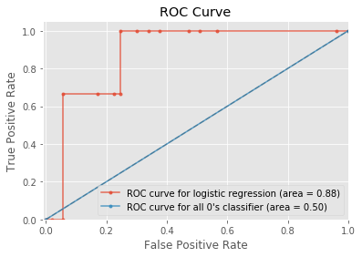

## Contents
{:.no_toc}
*  
{: toc}

## Models

## 0. Import libraries


```python
import numpy as np
import pandas as pd
import matplotlib
import matplotlib.pyplot as plt
from sklearn.linear_model import LogisticRegressionCV
from sklearn.linear_model import LogisticRegression
from sklearn.model_selection import train_test_split
import sklearn.metrics as metrics
from sklearn.discriminant_analysis import LinearDiscriminantAnalysis
from sklearn.neighbors import KNeighborsClassifier
from sklearn.model_selection import cross_val_score
from sklearn.model_selection import KFold
from sklearn.tree import DecisionTreeClassifier
from sklearn.ensemble import RandomForestClassifier
from sklearn.ensemble import AdaBoostClassifier
import seaborn as sns
import math
%matplotlib inline
plt.style.use('ggplot')
```


## 1. Load Data


```python
## Divide to train and test
data = pd.read_csv("data_model.csv",index_col=0)
data = data.drop('ABETA',1).drop('TAU',1).drop('PTAU',1)
data = data[np.isfinite(data['ADAS13_bl'])]
np.random.seed(9001)
msk = np.random.rand(len(data)) < 0.75
data_train = data[msk]
data_test = data[~msk]

X_train = data_train.drop('MCI_reversion_2y',1)
y_train = data_train['MCI_reversion_2y'].values
X_test = data_test.drop('MCI_reversion_2y',1)
y_test = data_test['MCI_reversion_2y'].values

## Normalization
attr_nums = ['AGE','RAVLT_immediate_bl','ADAS13_bl','CATANIMSC']
attr_cats = ['PTGENDER', 'PTMARRY', 'APOE4']

x_train = pd.get_dummies(X_train, columns=attr_cats, drop_first=True)
x_test = pd.get_dummies(X_test, columns=attr_cats, drop_first=True)

means = {attr_num: np.mean(x_train[attr_num]) for attr_num in attr_nums}
sds = {attr_num: np.std(x_train[attr_num], ddof=1) for attr_num in attr_nums}
for attr_num in attr_nums:
    x_train[attr_num] = (x_train[attr_num] - means[attr_num]) / sds[attr_num]
    x_test[attr_num] = (x_test[attr_num] - means[attr_num]) / sds[attr_num]
```


## 2. Classification Model


```python
def tpr(confusion_matrix):
    return confusion_matrix[1][1]/np.sum(confusion_matrix[1])
def fpr(confusion_matrix):
    return confusion_matrix[0][1]/np.sum(confusion_matrix[0])
```


 ### Logistic Regression


```python
##  Logistic Regression 
logistic = LogisticRegressionCV(cv=5, penalty='l2').fit(x_train, y_train)
logistic_acc_train = logistic.score(x_train, y_train)
logistic_acc_test = logistic.score(x_test, y_test)
cm_log = metrics.confusion_matrix(y_train, logistic.predict(x_train))
auc_log= metrics.roc_auc_score(y_train, logistic.predict_proba(x_train)[:,1])
```


### Linear Discriminant Analysis


```python
## Linear Discriminant Analysis
lda = LinearDiscriminantAnalysis().fit(x_train, y_train)
lda_acc_train = lda.score(x_train, y_train)
lda_acc_test = lda.score(x_test, y_test)
cm_lda = metrics.confusion_matrix(y_train, lda.predict(x_train))
auc_lda= metrics.roc_auc_score(y_train, lda.predict_proba(x_train)[:,1])
auc_log_test= metrics.roc_auc_score(y_test, logistic.predict_proba(x_test)[:,1])
auc_lda_test= metrics.roc_auc_score(y_test, lda.predict_proba(x_test)[:,1])
```


### KNN


```python
## KNN
neighbors = list(range(1,20))
cv_scores = []
for k in neighbors:
    knn = KNeighborsClassifier(n_neighbors=k)
    scores = cross_val_score(knn, x_train, y_train, cv=5, scoring='accuracy')
    cv_scores.append(scores.mean())
MSE = [1 - x for x in cv_scores]
### determining best k
optimal_k = neighbors[MSE.index(min(MSE))]
print ("The optimal number of neighbors is %d" % optimal_k)
knn=KNeighborsClassifier(16).fit(x_train, y_train)
knn_acc_train = knn.score(x_train, y_train)
knn_acc_test = knn.score(x_test, y_test)
cm_knn = metrics.confusion_matrix(y_train, knn.predict(x_train))
auc_knn= metrics.roc_auc_score(y_train, knn.predict_proba(x_train)[:,1])
auc_knn_test= metrics.roc_auc_score(y_test, knn.predict_proba(x_test)[:,1])
```


    The optimal number of neighbors is 6


### Decision Tree


```python
## decision tree
### Use 5-fold cross-validation to choose the (maximum) depth for the tree
depths = range(2,25)
cv_scores_dt = []
for depth in depths:
    dt = DecisionTreeClassifier(max_depth=depth)
    scores = cross_val_score(dt, x_train, y_train, cv=5, scoring='accuracy')
    cv_scores_dt.append(scores.mean())
best_depth = depths[np.argmax(cv_scores_dt)]
print('The best maximum depth is %d'%(best_depth))

dt = DecisionTreeClassifier(max_depth=best_depth)
dt.fit(x_train, y_train)

dt_acc_train = dt.score(x_train, y_train)
dt_acc_test = dt.score(x_test, y_test)
cm_dt = metrics.confusion_matrix(y_train, dt.predict(x_train))
auc_dt= metrics.roc_auc_score(y_train, dt.predict_proba(x_train)[:,1])
auc_dt_test= metrics.roc_auc_score(y_test, dt.predict_proba(x_test)[:,1])
```


    The best maximum depth is 3


### Random Forest


```python
##RF
### Fit random forest models to the training set for different number of trees
n_trees = 2**np.arange(1,9)
rf_acc_train = []
rf_acc_test = []
for n_tree in n_trees:
    rf = RandomForestClassifier(n_estimators=n_tree, max_features='sqrt', max_depth=best_depth)
    rf.fit(x_train, y_train)
    rf_acc_train.append(rf.score(x_train, y_train))
    rf_acc_test.append(rf.score(x_test, y_test))
df_rf = pd.DataFrame()
df_rf['Number of trees'] = n_trees
df_rf['Training accuracy'] = rf_acc_train
df_rf['Test accuracy'] = rf_acc_test
df_rf

```


<div>
<style>
    .dataframe thead tr:only-child th {
        text-align: right;
    }

    .dataframe thead th {
        text-align: left;
    }

    .dataframe tbody tr th {
        vertical-align: top;
    }
</style>
<table border="1" class="dataframe">
  <thead>
    <tr style="text-align: right;">
      <th></th>
      <th>Number of trees</th>
      <th>Training accuracy</th>
      <th>Test accuracy</th>
    </tr>
  </thead>
  <tbody>
    <tr>
      <th>0</th>
      <td>2</td>
      <td>0.938462</td>
      <td>0.928571</td>
    </tr>
    <tr>
      <th>1</th>
      <td>4</td>
      <td>0.938462</td>
      <td>0.946429</td>
    </tr>
    <tr>
      <th>2</th>
      <td>8</td>
      <td>0.938462</td>
      <td>0.946429</td>
    </tr>
    <tr>
      <th>3</th>
      <td>16</td>
      <td>0.953846</td>
      <td>0.946429</td>
    </tr>
    <tr>
      <th>4</th>
      <td>32</td>
      <td>0.946154</td>
      <td>0.946429</td>
    </tr>
    <tr>
      <th>5</th>
      <td>64</td>
      <td>0.946154</td>
      <td>0.946429</td>
    </tr>
    <tr>
      <th>6</th>
      <td>128</td>
      <td>0.946154</td>
      <td>0.946429</td>
    </tr>
    <tr>
      <th>7</th>
      <td>256</td>
      <td>0.946154</td>
      <td>0.946429</td>
    </tr>
  </tbody>
</table>
</div>


```python
rf = RandomForestClassifier(n_estimators=8, max_features='sqrt', max_depth=best_depth)
rf.fit(x_train, y_train)
rf_acc_train = rf.score(x_train, y_train)
rf_acc_test = rf.score(x_test, y_test)
cm_rf = metrics.confusion_matrix(y_train, rf.predict(x_train))
auc_rf= metrics.roc_auc_score(y_train, rf.predict_proba(x_train)[:,1])
auc_rf_test= metrics.roc_auc_score(y_test, rf.predict_proba(x_test)[:,1])
```


### Boosting


```python
## Boosting
n_tree = 2**np.arange(1,5)
depths = [1,2,10,None]
cv_scores_bo = {}
for depth in depths:
    for n in n_tree:
        adaboost = AdaBoostClassifier(DecisionTreeClassifier(max_depth=depth), n_estimators=n, learning_rate=0.05)
        scores = cross_val_score(adaboost, x_train, y_train, cv=5, scoring='accuracy')
        cv_scores_bo[(depth,n)] = scores.mean()
best_depth, best_n_tree = max(cv_scores_bo, key=cv_scores_bo.get)
print('The optimal maximum depth is %d\nThe optimal number of trees is %d'%(best_depth, best_n_tree))
adaboost = AdaBoostClassifier(DecisionTreeClassifier(max_depth=best_depth), n_estimators=best_n_tree, learning_rate=0.05)
adaboost.fit(x_train, y_train)
adaboost_acc_train = adaboost.score(x_train, y_train)
adaboost_acc_test = adaboost.score(x_test, y_test)
cm_adaboost = metrics.confusion_matrix(y_train, adaboost.predict(x_train))
auc_adaboost= metrics.roc_auc_score(y_train, adaboost.predict_proba(x_train)[:,1])
auc_adaboost_test= metrics.roc_auc_score(y_test, adaboost.predict_proba(x_test)[:,1])
```


    The optimal maximum depth is 2
    The optimal number of trees is 16


### Model Performance


```python
model = ['Logistic regression','LDA','k-NN','Decision Tree','Random Forest','Adaboost']
column = [ 'Training accuracy','Test accuracy','True postive rate','AUC_training','AUC_test']

models = pd.DataFrame(index=model, columns=column)
models['Training accuracy']=[logistic_acc_train, lda_acc_train,knn_acc_train,dt_acc_train,rf_acc_train,adaboost_acc_train]
models['Test accuracy']=[logistic_acc_test, lda_acc_test,knn_acc_test,dt_acc_test,rf_acc_test,adaboost_acc_test]
models['True postive rate']=[tpr(cm_log), tpr(cm_lda),tpr(cm_knn),tpr(cm_dt),tpr(cm_rf),tpr(cm_adaboost)]
models['AUC_training']=[auc_log, auc_lda,auc_knn,auc_dt,auc_rf,auc_adaboost]
models['AUC_test']=[auc_log_test, auc_lda_test,auc_knn_test,auc_dt_test,auc_rf_test,auc_adaboost_test]
models

```


<div>
<style>
    .dataframe thead tr:only-child th {
        text-align: right;
    }

    .dataframe thead th {
        text-align: left;
    }

    .dataframe tbody tr th {
        vertical-align: top;
    }
</style>
<table border="1" class="dataframe">
  <thead>
    <tr style="text-align: right;">
      <th></th>
      <th>Training accuracy</th>
      <th>Test accuracy</th>
      <th>True postive rate</th>
      <th>AUC_training</th>
      <th>AUC_test</th>
    </tr>
  </thead>
  <tbody>
    <tr>
      <th>Logistic regression</th>
      <td>0.923077</td>
      <td>0.946429</td>
      <td>0.0</td>
      <td>0.898333</td>
      <td>0.874214</td>
    </tr>
    <tr>
      <th>LDA</th>
      <td>0.930769</td>
      <td>0.964286</td>
      <td>0.3</td>
      <td>0.935833</td>
      <td>0.509434</td>
    </tr>
    <tr>
      <th>k-NN</th>
      <td>0.923077</td>
      <td>0.946429</td>
      <td>0.0</td>
      <td>0.879583</td>
      <td>0.735849</td>
    </tr>
    <tr>
      <th>Decision Tree</th>
      <td>0.953846</td>
      <td>0.928571</td>
      <td>0.4</td>
      <td>0.920833</td>
      <td>0.628931</td>
    </tr>
    <tr>
      <th>Random Forest</th>
      <td>0.938462</td>
      <td>0.946429</td>
      <td>0.4</td>
      <td>0.966250</td>
      <td>0.805031</td>
    </tr>
    <tr>
      <th>Adaboost</th>
      <td>0.969231</td>
      <td>0.946429</td>
      <td>0.6</td>
      <td>0.990417</td>
      <td>0.880503</td>
    </tr>
  </tbody>
</table>
</div>


### ROC curve for adaboost


```python
fpr1, tpr1, thresholds1 = metrics.roc_curve(y_test, adaboost.predict_proba(x_test)[:,1])
fpr2, tpr2, thresholds2 = metrics.roc_curve(y_test, np.zeros(len(y_test)))
auc1 = metrics.roc_auc_score(y_test, adaboost.predict_proba(x_test)[:,1])
auc2 = metrics.roc_auc_score(y_test, np.zeros(len(y_test)))
plt.plot(fpr1, tpr1, '.-', alpha=0.8, label='ROC curve for logistic regression (area = %0.2f)' % (auc1))
plt.plot(fpr2, tpr2, '.-', alpha=0.8, label='ROC curve for all 0\'s classifier (area = %0.2f)' % (auc2))
plt.plot([0, 1], [0, 1], 'k--', alpha=0.2)
plt.xlim([-0.01, 1.0])
plt.ylim([0.0, 1.05])
plt.xlabel('False Positive Rate')
plt.ylabel('True Positive Rate')
plt.title('ROC Curve')
plt.legend(loc="lower right");
```




